### Setup recon

```bash
nmap -A -vv -p- 172.16.232.7 -oN nmap_result_arthemis
```

```bash
 Nmap 7.91 scan initiated Wed Mar 24 10:57:43 2021 as: nmap -A -vv -p- -oN nmap_result_arthemis 172.16.232.7
 Nmap scan report for 172.16.232.7
 Host is up, received syn-ack (0.10s latency).
 Scanned at 2021-03-24 10:57:43 CET for 3040s
 Not shown: 65532 closed ports
 Reason: 65532 conn-refused
 PORT      STATE SERVICE REASON  VERSION
 
 80/tcp    open  http    syn-ack Apache httpd 2.4.29 ((Ubuntu))
 |_http-generator: TYPO3 4.5 CMS
 | http-methods:
 |_  Supported Methods: GET POST OPTIONS HEAD
 |_http-server-header: Apache/2.4.29 (Ubuntu)
 |_http-title:  LESGI, la grande \xC3\xA9cole informatique \xC3\xA0 Paris de Bac \xC3\xA0 Bac+5
 
 25452/tcp open  ssh     syn-ack OpenSSH 7.6p1 Ubuntu 4ubuntu0.3 (Ubuntu Linux; protocol 2.0)
 | ssh-hostkey:
 |   2048 e4:e4:c3:c7:4f:8b:0e:a3:53:bc:7a:a6:0f:43:19:61 (RSA)
 | ssh-rsa AAAAB3NzaC1yc2EAAAADAQABAAABAQDRoHQ7NA7HaqoRdkAt0ZyNXzLnAWENkdFDG64opLvKnsHNP7qFCHFXnT/3fV6TOFXpNiyNL4GTSkcDYIdurBFkohB0H0xunvpn1jSN3hGx+E2 J1A0g9AbqptfHFwRmSJ+zx+GfCoD7RYI0Oy4D3SdVihSzCzSZu93Wr1OGoo3UQ85wfdEowcttBazickYTsSLv0bWIXWh77920Ivw83RJG3LdHoj8a85h+hPkcd9lbaru2tSMHHjxVC2do/JB1aGae KCLqRMCBZLP4efC0rvp2pSTIRhcQgyKa1IvA0vdcye+ASnJKWYOaMht4KJLFfWNj0gjjdHy7UdrAar086xHT
 |   256 62:af:ab:21:35:75:f6:8f:99:3d:d5:eb:19:fe:43:0e (ECDSA)
 | ecdsa-sha2-nistp256 AAAAE2VjZHNhLXNoYTItbmlzdHAyNTYAAAAIbmlzdHAyNTYAAABBBDq9V7se1L0s8qp+Y+zdxk5qBioiJPHaQ8amDWgNmUJ0/bu9RteeRjVimsdV7yUUcjnct6WNvZG 9PBGFmacOpbI=
 |   256 4a:3c:bb:38:8c:ef:4a:dd:19:26:47:67:11:04:60:fa (ED25519)
 |_ssh-ed25519 AAAAC3NzaC1lZDI1NTE5AAAAIKr91sYv9fRa/QyISfvb1p6EgaPGJrelLa4HktQRznHK
 
 61337/tcp open  ftp     syn-ack vsftpd 2.0.8 or later
 | ftp-anon: Anonymous FTP login allowed (FTP code 230)
 | -rw-r--r--    1 0        0             207 Mar 22 23:05 letters.txt
 |_drwxr-xr-x    2 0        0            4096 Mar 23 01:15 logs
 | ftp-syst:
 |   STAT:
 | FTP server status:
 |      Connected to ::ffff:172.16.232.1
 |      Logged in as ftp
 |      TYPE: ASCII
 |      No session bandwidth limit
 |      Session timeout in seconds is 300
 |      Control connection is plain text
 |      Data connections will be plain text
 |      At session startup, client count was 4
 |      vsFTPd 3.0.3 - secure, fast, stable
 |_End of status
 Service Info: OS: Linux; CPE: cpe:/o:linux:linux_kernel

 Read data files from: /usr/local/bin/../share/nmap
 Service detection performed. Please report any incorrect results at https://nmap.org/submit/ .
```

As we can see, several ports are open, the last one being port **61337** which hides a small ftp service with an authorized Anonymous connection.

---

### FTP access

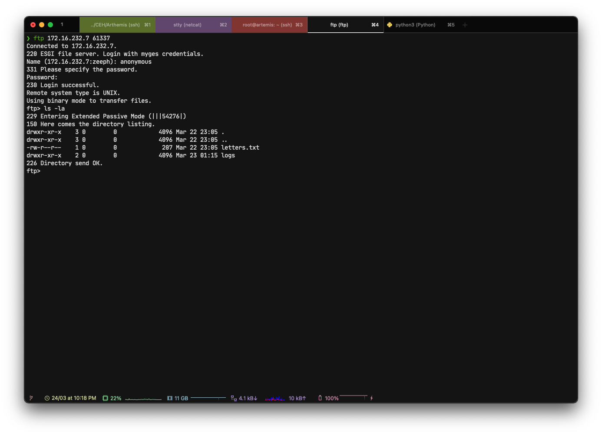

Credentials :

```txt
Username : anonymous
Password : none
```

I will use the `mget *` command to retrieve all the files on the FTP

Once the files are extracted, I'll `grep` the log files to get only the 200 code in HTTP

```bash
cat access.log | grep 200 > access.log.filtered
```

```bash
192.168.204.133 - - [22/Mar/2021:22:16:43 +0300] "GET / HTTP/1.0" 200 433 "-" "-"
192.168.204.133 - - [22/Mar/2021:22:16:45 +0300] "GET / HTTP/1.0" 200 433 "-" "-"
192.168.204.133 - - [22/Mar/2021:22:16:50 +0300] "GET / HTTP/1.0" 200 433 "-" "-"
192.168.204.133 - - [22/Mar/2021:22:16:50 +0300] "GET / HTTP/1.1" 200 414 "-" "-"
192.168.204.133 - - [22/Mar/2021:22:23:49 +0300] "GET / HTTP/1.1" 200 446 "-" "Mozilla/5.0 (X11; Linux x86_64; rv:78.0) Gecko/20100101 Firefox/78.0"
192.168.204.133 - - [22/Mar/2021:22:37:16 +0300] "GET / HTTP/1.1" 200 24301 "-" "Mozilla/5.0 (X11; Linux x86_64; rv:78.0) Gecko/20100101 Firefox/78.0 "
192.168.204.133 - - [22/Mar/2021:22:37:17 +0300] "GET / HTTP/1.1" 200 24301 "-" "Mozilla/5.0 (X11; Linux x86_64; rv:78.0) Gecko/20100101 Firefox/78.0 "
192.168.204.133 - - [22/Mar/2021:22:39:16 +0300] "GET / HTTP/1.1" 200 8704 "-" "Mozilla/5.0 (X11; Linux x86_64; rv:78.0) Gecko/20100101 Firefox/78.0" 
192.168.204.133 - - [22/Mar/2021:22:42:42 +0300] "GET / HTTP/1.1" 200 8704 "-" "Mozilla/5.0 (X11; Linux x86_64; rv:78.0) Gecko/20100101 Firefox/78.0" 
192.168.204.133 - - [22/Mar/2021:22:56:00 +0300] "GET /**0cdb312366ecf1f493bc83f0fb56adda28125498762f28f1cc40c320300125ce/** HTTP/1.1" 200 444 "-" "Mozil la/5.0 (X11; Linux x86_64; rv:78.0) Gecko/20100101 Firefox/78.0"
192.168.204.133 - - [22/Mar/2021:22:44:32 +0300] "GET / HTTP/1.1" 200 11082 "-" "Mozilla/5.0 (X11; Linux x86_64; rv:78.0) Gecko/20100101 Firefox/78.0 "
192.168.204.133 - - [22/Mar/2021:22:44:34 +0300] "GET / HTTP/1.1" 200 11081 "-" "Mozilla/5.0 (X11; Linux x86_64; rv:78.0) Gecko/20100101 Firefox/78.0 "
```

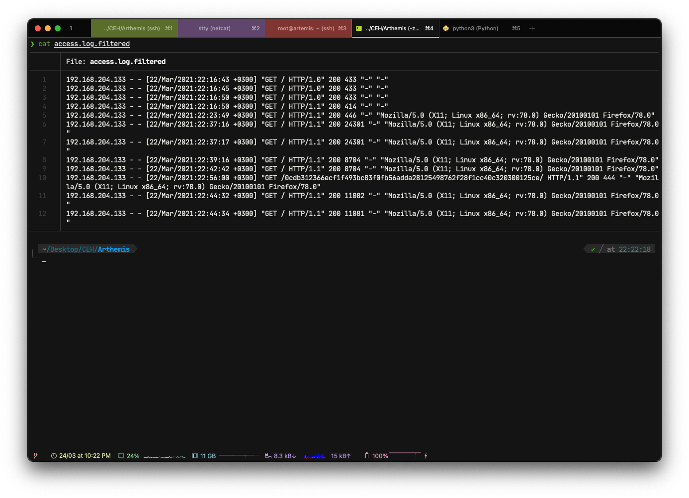

### **LFI TO RCE**

As you can see, we have an unusual url for a website.

I'll run a bruteforce scan of the directory

```bash
# Personally I use feroxbuster it's a tool identical to gobuster or dirb
feroxbuster --url http://172.16.232.7/0cdb312366ecf1f493bc83f0fb56adda28125498762f28f1cc40c320300125ce/ --extensions cgi,py,bak,php,pdf,asp,html,xml,json,txt,js -o export_feroxbuster_path_zarb
```

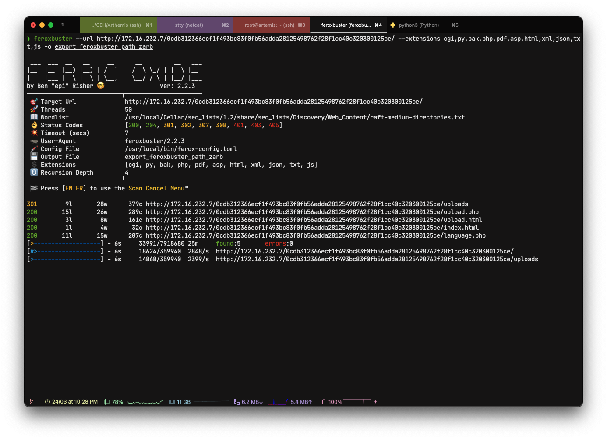

```
/uploads
/upload.php
/upload.html
/language.php
/index.html
/
/.php
/.html
**/uploads/**
/uploads/.php
/uploads/.html
/uploads
**/upload.php**
/upload.html
/index.html
**/language.php**
```

Let's take a little look at the interesting paths 👀

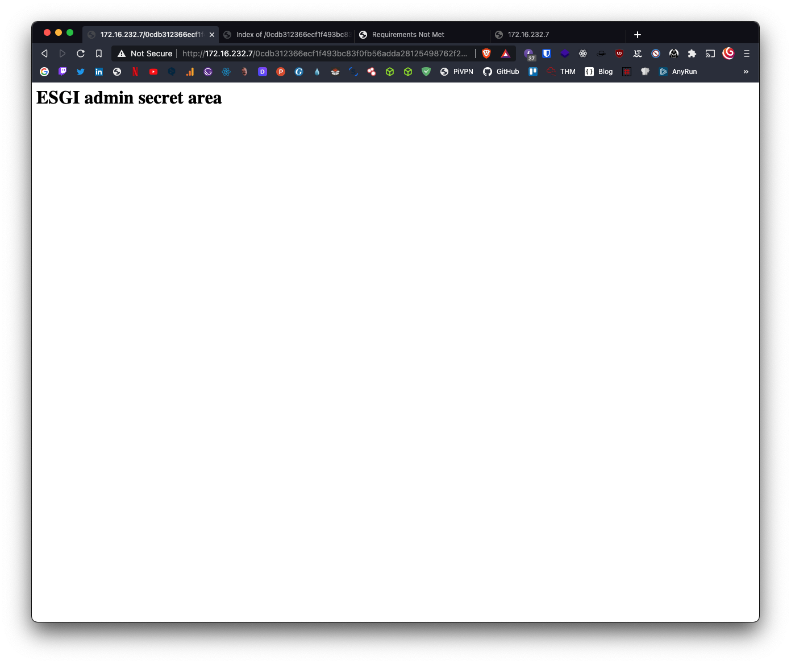

An upload, which will perhaps be useful to us to reach the machine 👀


The upload directory


A language button

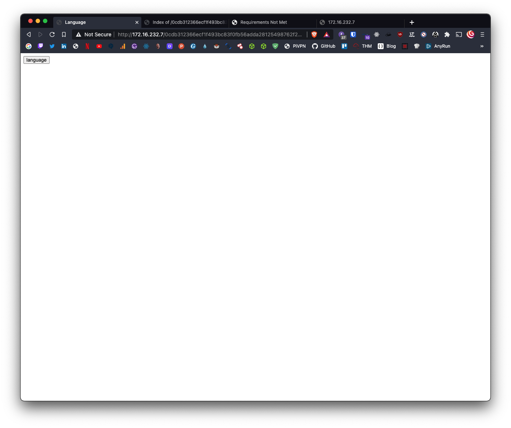

I'll run `burp suite` to try to upload some shells


After intercepting the connection with burp I sent it to `Reapter` to avoid retyping the request every time I try.

As you can see here I used a "*classic*" reverse shell with the help of [my chrome extension](https://github.com/LasCC/Hack-Tools) **#AD**

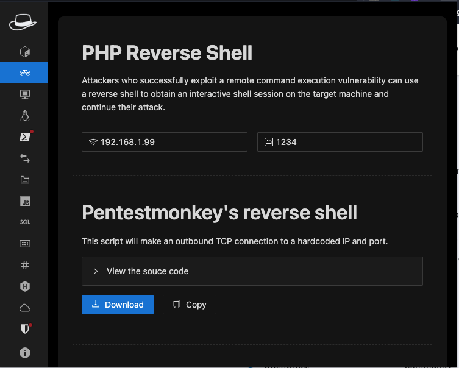


Unfortunately, the application has a filter that checks the extensions and sends us an error as soon as an uploaded file does not have a `.jpg, .png, .jpeg` extension.

The error in question

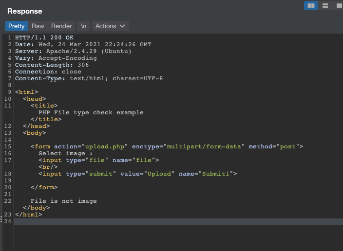

Let's try to bypass the filter by adding a `.jpg`.

And there you go! 🤌 The filter did bypass as expected.

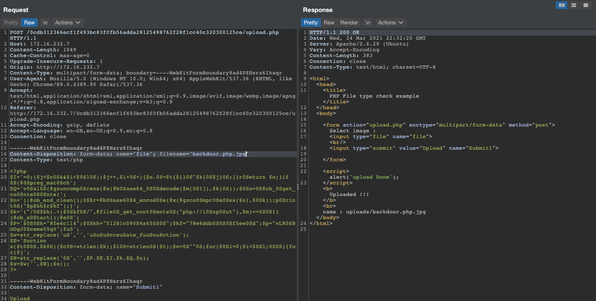

Let's check the path `/uploads` to see if our backdoor has been placed in the right folder.

And as you can see, our backdoor is there

*(Don't pay attention to the other files, I tested several methods of bypassing the filter)*

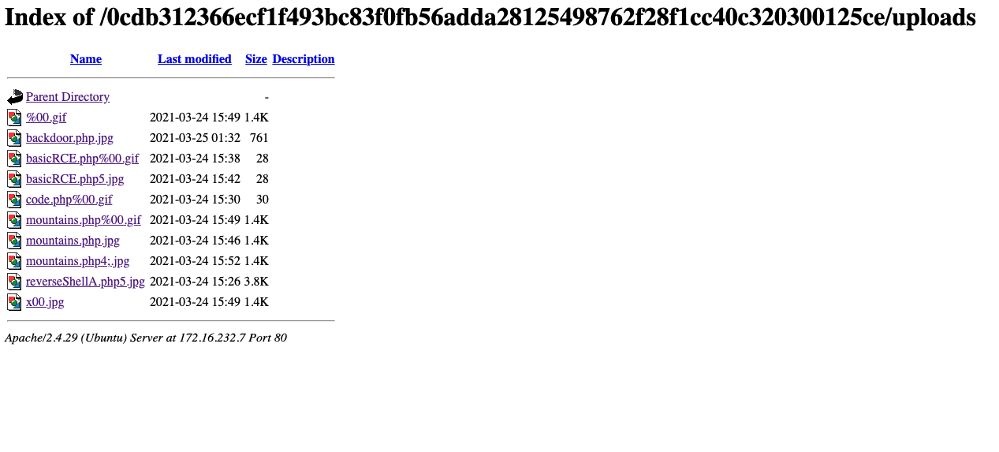

When we click on our backdoor nothing happens, which is quite logical because the apache server thinks that our backdoor is an image (hence the `.jpg` at the end of the uploader file)

Now let's go back to the language button we saw earlier.

At first sight, nothing special, but something is hiding behind this little button.


I'll intercept the connection with burp next to explain how I got a `LFI` that I turned into a `RCE`.

As you can see, we have access to a variable that we can exploit in the url, more precisely the `?lang=` variable


Now I'm going to use a payload that is present on [my extension](https://github.com/LasCC/Hack-Tools) **#AD2** that will allow us to do some directory traversal

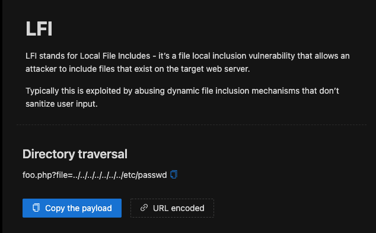


Let's take a moment to analyze the situation of our pentest

- We have uploaded our `backdoor in php` but it is not yet executable by the server
- We have access to a Directory Traversal with the `language.php` file

If we combine the two access methods, we can try to run our own `backdoor` from the `LFI` discovered earlier.

### RCE (Accès à la machine depuis le www-data)

With the combination of our two methods, as expected, we managed to execute our backdoor and thus have our first access to the machine 🙌

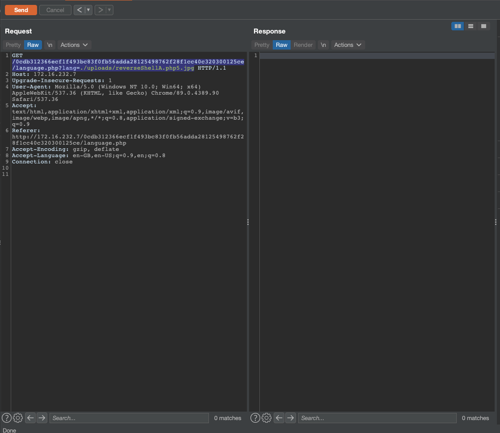

```bash
# Since we are in the same directory, we just need to go to the upload directory and select our backdoor."/uploads/reverseShellA.php5.jpg"
GET /0cdb312366ecf1f493bc83f0fb56adda28125498762f28f1cc40c320300125ce/language.php?lang=./uploads/reverseShellA.php5.jpg HTTP/1.1
```


For my sanity, I'll show you how to upgrade a classic TTY shell to a shell that works perfectly with autocomplete.

As a reminder, this method is available directly on [my chrome extension](https://github.com/LasCC/Hack-Tools) *#AD3 (I promise to stop)*


And that's it! We have a perfectly working shell, we can start with a good basis to find an access on another user.


Once in the `/var/www/html` folder we can see a `backups-4e45a234079C45bc326b12ce453` folder which does not appear on the log file we exfiltrated from the FTP earlier.

After a few minutes of searching every little folder and file in the directory, I carefully looked at the `users.sql` file

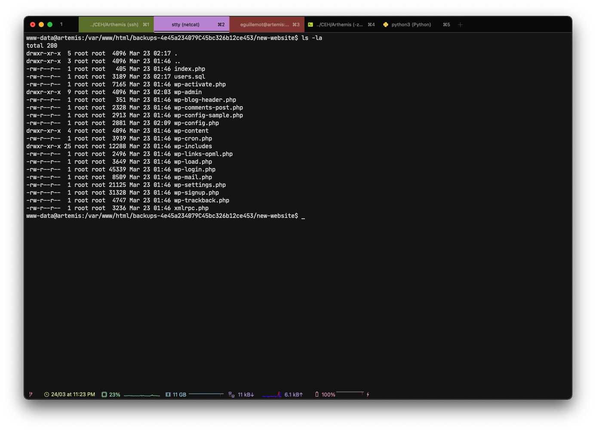

And as you can see from the highlighted line, we have our user account `eguillemot` with a hash `B38E48ED65DF090D475F5F25E030D183BC140ECD`

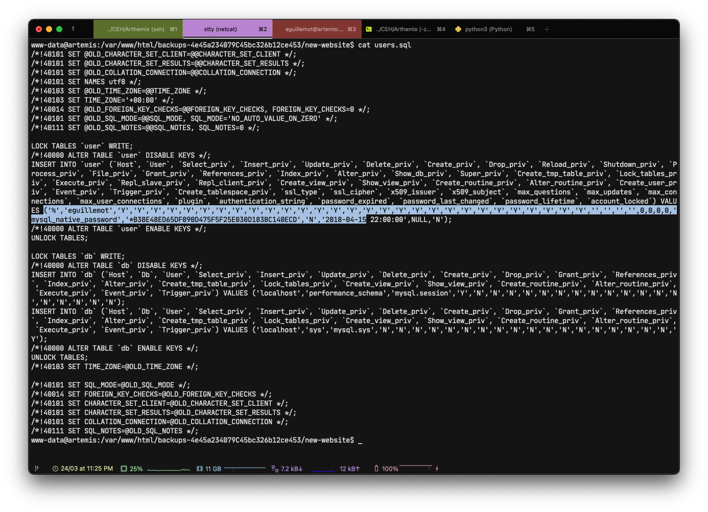

To crack the hash there are several methods/tools like `hashcat` `john` and many others.

But for my part, I used the `crackstation` utility which is available online.


And that's it! We have access to our first user from `www-data` to the `eguillemot` user

```
ssh login
Username: eguillemot
Password: esgi
```

### Login to user eguillemot

```bash
# As a reminder, the SSH connection is on port 25452
❯ ssh eguillemot@172.16.232.7 -p 25452
```

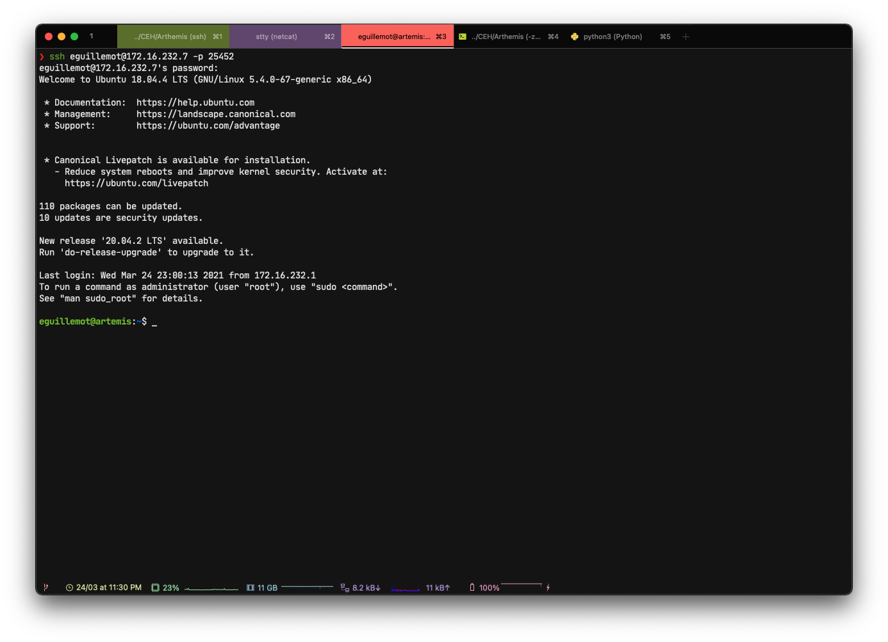

### First flag


```bash
eguillemot@artemis:~$ cat user.txt
CEH{Wh4t_4_w0nd3rfUl_w3bs1t3}
```

Now that we are on the user eguillemot, we need to find a way to access the user khenno

To do this, I'm going to use a very nice utility that allows me to display all the configurations/files present on the machine that could be compromising for another user.

`LinEnum` Repository ⬇️

[rebootuser/LinEnum](https://github.com/rebootuser/LinEnum/blob/master/LinEnum.sh)

To avoid writing errors I put the `LinEnum` script in the directory `/dev/shm` it's a development directory which normally contains `shared memory` so no writing problem in this kind of directory.

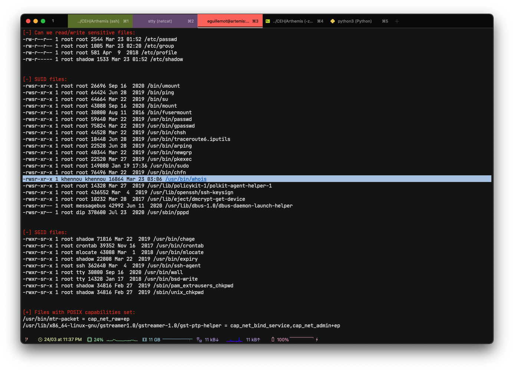

As you can see from the `LinEnum` script we have a binary that is not normally present on Linux machines, especially since the binary in question has access to the user we want to compromise. 

### Reverse engineering

We will now concentrate on the reverse engineering part, for this exercise I will use the `gdb` utility with the `peda` plugin

But before starting, I used `Ghidra` to generate a pseudo-code of the application so that I can have an idea of how it works.

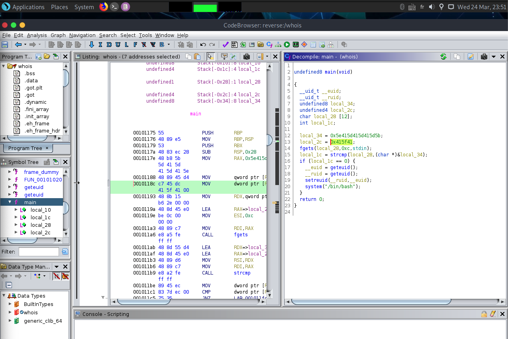

```c
{
  __uid_t __euid;
  __uid_t __ruid;
  undefined8 local_34;
  undefined4 local_2c;
  char local_28 [12]; // Tableau de 12 char max
  int local_1c; 
  
  local_34 = 0x5e415d415d415d5b; // String
  local_2c = 0x415f41; // Non utilisé
  fgets(local_28,0xc,stdin); // Input de l'application
  local_1c = strcmp(local_28,(char *)&local_34); // Comparaison 
  if (local_1c == 0) { // Si la comparaison est true on passe bash
    __euid = geteuid();
    __ruid = geteuid();
    setreuid(__ruid,__euid);
    system("/bin/bash");
  }
  return 0;
}
```

Now that we have an idea of how the application behaves, I'll explain how to reverse the binary with `gdb


First we will start with a `disass main` and then we will place a breakpoint.

Here we are in the stack! 🥴


I'll avoid all the futile information and go straight to the heart of the matter.

We are, in the moment of the stack or the program asks us to enter a value, for the test I will voluntarily put AAAA.


Now we come to the moment of comparison


And as you can see the program has just jumpered to a leave function, which proves to us that the comparison has failed


But as you can see, it compares the string `[]A]A^A_A` with our manually entered `AAAA`.


### Exploiting the binary

As seen before, we have found a string `[]A]A^A_A`, we will try it on the user machine to try to spawn a shell with the user `khennou`.

That's it! We have just exploited the binary passing from `www-data` → `eguillemot` → `khennou`


Once on the last user, it will be enough to make a small `sudo -l` to see if it belongs to the `sudoers`.


That's fine, we have access to root with the following command in `nopasswd`.

```bash
sudo su
```

### Rooted

```bash
root@artemis:~> cat root.txt
CEH{B4ckd0or3d_3SG1????}
```

