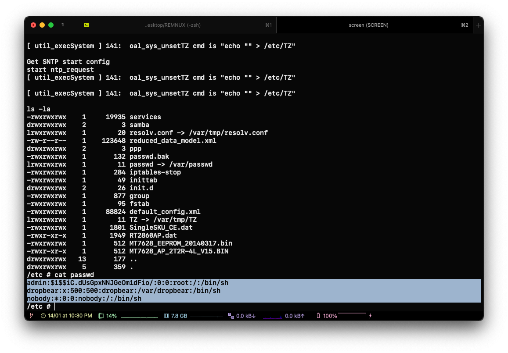
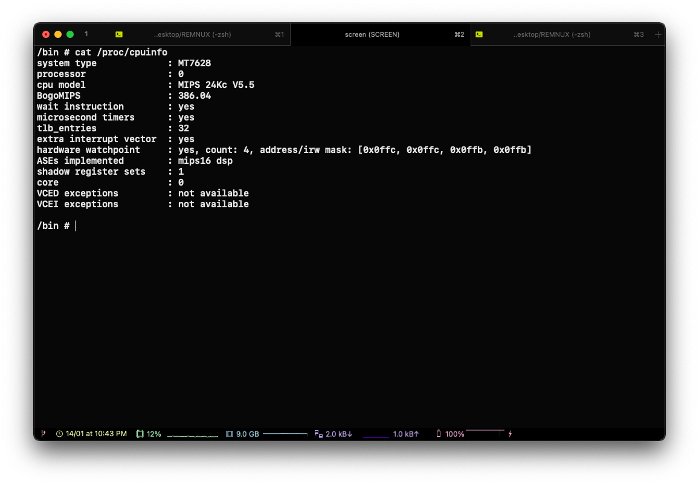
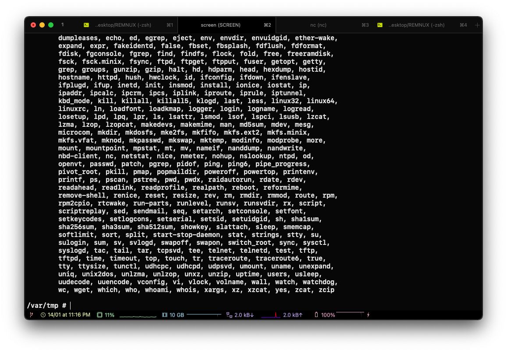
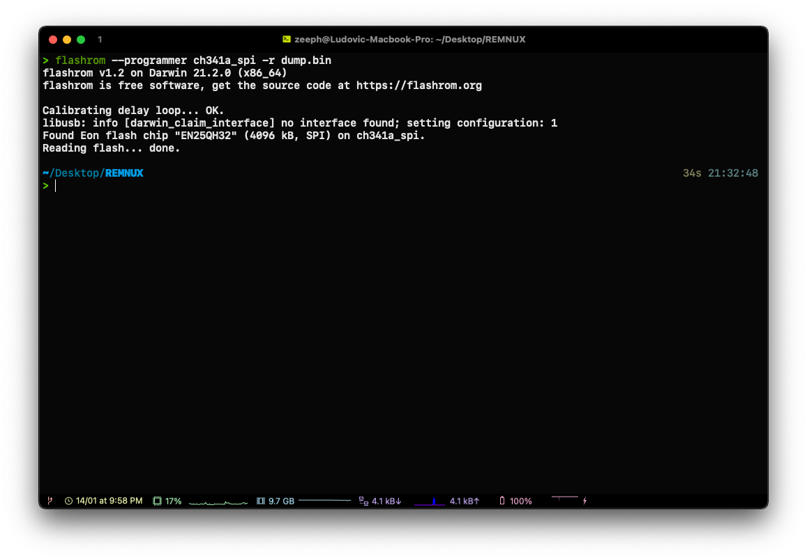
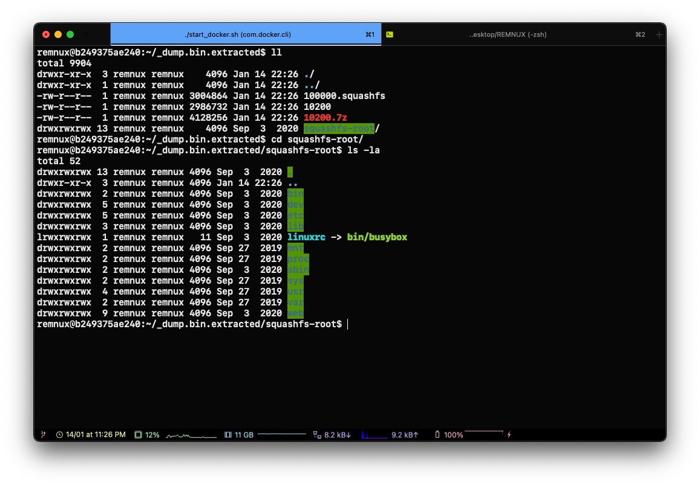

Hello everyone, after a few months of not posting anything on my blog I decided to launch a small series of articles about reverse hardware more precisely about IoT (Internet of Things).

On this article I will show you how to extract the firmware with very affordable tools for small budgets.

The target is a TP-Link wireless router, a very simple target to start with as it has no firmware encryption.

### The tools needed to carry out the project:

- 1 - A Laptop
- 2 - TP-Link router ([ref](https://www.amazon.com/gp/product/B001FWYGJS))
- 3 - Multimiter
- 4 - A USB to UART ([ref](https://www.aliexpress.com/item/4000120687489.html))
- 5 - And finally, a flash programming module ([ref](https://aliexpress.com/item/33054397283.html))

As a reminder, no affiliate links are present on the article links.

Well, once you have all the necessary tools, we can start our topic. But before we start, I haven't explained the purpose of our first part yet.

### Objectives

In this first part, we will discuss how the debug ports (UART) can be used, we will also see how to access a Linux terminal, and finally we will perform a firmware dump.

Of course, the firmware is available on the official website of the manufacturer (TP-Link) but let's assume that it is not and that we have to do a manual extraction.

----

## Reconnaissance

In the United States, most wireless devices have an FCC (Federal Communications Commission) identifier, the identifier can allow us to have images of the open device for example and more...


The login that I've retrieved is the following: `TE7WR841NV14`

Here is what we can find just with an identifier: [https://fccid.io/TE7WR841NV14](https://fccid.io/TE7WR841NV14)

We have clear pictures of the device, chips and even the motherboard which is perfect to learn more about our subject.

### List of electronic chips present in the router :


Documentation / Datasheet : [Rutronik24 Distributor](https://www.rutronik24.com/product/zentel/a3s56d40gtp-50/13858310.html)

`A3S56D40GTP-50L` corresponds to SDRAM **(DDR-SDRAM 256Mb 16Mx16 200MHz)** memory


Documentation / Datasheet : [MT7628K/N/A](https://www.mediatek.com/products/homeNetworking/mt7628k-n-a)

`MT7628K/N/A` the CPU.


**Legend :**
1. 1 - `A3S56D40GTP-50d` SDRAM
2. 2 - The `MT7628K/N/A` SOC (System on Chip)
3. 3 - ROM containing the firmware that we will extract by the end of the article.
4. 4 - UART Connectors. (UART → universal asynchronous receiver-transmitter)

The question that comes up now, is how to write on ROM (Read Only Memory) it seems impossible since it is read-only?

But it is not ROM like the others, it is in fact an EPROM (Erasable Read-Only Memory) that remains of course ROM but they can be reprogrammed with specific tools that we will see in this article.

----

## Connection to the Linux terminal

Before we start, let's define what a UART connector is and how to connect to it.

UART stands for Universal Asynchronous Receiver/Transmitter or, as I like to call it, "yo**U** **A**re **R**oo**T**". UART is a direct serial bus communication technology. But be careful! It is not a communication protocol but rather a direct interface to the serial bus.

Generally the UART is quite easy to locate on the PCB (Printed Circuit Board) with 3/4 pins and isolated from the rest of the components.

In our case we are lucky, on the PCB we have the signification of the four pins right next to it.


**Legend :**
1. 1 - VCC → Voltage (usually 3.3v)
2. 2 - GND → Ground
3. 3 - RX → Receiver
4. 4 - TX → Transmitter

For our case study, we will only use 3 pins `GND` `RX` & `TX` , now what tool are we going to use to receive and transmit data on the connector ?

As seen previously at the beginning of the article, we will use a USB to UART (you can find the reference at the beginning of the article).


In order for the two devices to communicate, we need to invert the `RX` and `TX` to ensure proper communication between them as seen above.

On some USB to UART, a switch is present to know what voltage we have to put, to be sure, we will measure with the multimeter the voltage of the router.


The measurement has been done on the VCC pin and GND.

As we can see, the voltage is 3.3V, if you have a switch on your USB to UART you can adjust it with the value you measured.

Once this is done, we can replace our pins with the necessary cables for transmission and of course, connect the USB to your computer.

To start, we'll try to find our USB on our machine, for this I'm going to use a tool called `lsusb` if you're on macOS like me you can easily install it with `homebrew`.

```bash
brew install lsusb
```


As you can see the USB key is well recognized on the computer. Now we will obtain the PATH of the USB with the following command:

```bash
ls /dev/ | grep -i usb
```


Once we have retrieved the value, we will use the `screen` command

*Screen is a full-screen window manager that multiplexes a physical terminal between several
processes (typically interactive shells).  Each virtual terminal provides the functions of a DEC
VT100 terminal and, in addition, several control functions from the ISO 6429 (ECMA 48, ANSI
X3.64) and ISO 2022 standards (e.g. insert/delete line and support for multiple character sets).
There is a scrollback history buffer for each virtual terminal and a copy-and-paste mechanism
that allows moving text regions between windows.*

```bash
screen /dev/tty.usbserial-14210 115200
screen [Your own usb PATH] [BAUD rate]
```

In our case, we will bruteforce the baud rate because I don't have an oscilloscope at hand, but the most known/standard values are the following:

<Alert severity="info">
    The baud is a common unit of measurement of symbol rate, which is one of the components that determine the speed of communication over a data channel.
</Alert>

| **Bauds**        | **Bits/s**        | **Bit duration** | **Speed**         | **Actual speed**  | **Actual byte duration** |
| ---------------- | ----------------- | ---------------- | ----------------- | ----------------- | ------------------------ |
| 50 bauds         | 50 bits/s         | 20.000 ms        | 6.25 bytes/s      | 5 bytes/s         | 200.000 ms               |
| 75 bauds         | 75 bits/s         | 13.333 ms        | 9.375 bytes/s     | 7.5 bytes/s       | 133.333 ms               |
| 110 bauds        | 110 bits/s        | 9.091 ms         | 13.75 bytes/s     | 11 bytes/s        | 90.909 ms                |
| 134 bauds        | 134 bits/s        | 7.463 ms         | 16.75 bytes/s     | 13.4 bytes/s      | 74.627 ms                |
| 150 bauds        | 150 bits/s        | 6.667 ms         | 18.75 bytes/s     | 15 bytes/s        | 66.667 ms                |
| 200 bauds        | 200 bits/s        | 5.000 ms         | 25 bytes/s        | 20 bytes/s        | 50.000 ms                |
| 300 bauds        | 300 bits/s        | 3.333 ms         | 37.5 bytes/s      | 30 bytes/s        | 33.333 ms                |
| 600 bauds        | 600 bits/s        | 1.667 ms         | 75 bytes/s        | 60 bytes/s        | 16.667 ms                |
| 1200 bauds       | 1200 bits/s       | 833.333 µs       | 150 bytes/s       | 120 bytes/s       | 8.333 ms                 |
| 1800 bauds       | 1800 bits/s       | 555.556 µs       | 225 bytes/s       | 180 bytes/s       | 5.556 ms                 |
| 2400 bauds       | 2400 bits/s       | 416.667 µs       | 300 bytes/s       | 240 bytes/s       | 4.167 ms                 |
| 4800 bauds       | 4800 bits/s       | 208.333 µs       | 600 bytes/s       | 480 bytes/s       | 2.083 ms                 |
| **9600 bauds**   | **9600 bits/s**   | **104.167 µs**   | **1200 bytes/s**  | **960 bytes/s**   | **1.042 ms**             |
| 19200 bauds      | 19200 bits/s      | 52.083 µs        | 2400 bytes/s      | 1920 bytes/s      | 520.833 µs               |
| 28800 bauds      | 28800 bits/s      | 34.722 µs        | 3600 bytes/s      | 2880 bytes/s      | 347.222 µs               |
| 38400 bauds      | 38400 bits/s      | 26.042 µs        | 4800 bytes/s      | 3840 bytes/s      | 260.417 µs               |
| 57600 bauds      | 57600 bits/s      | 17.361 µs        | 7200 bytes/s      | 5760 bytes/s      | 173.611 µs               |
| 76800 bauds      | 76800 bits/s      | 13.021 µs        | 9600 bytes/s      | 7680 bytes/s      | 130.208 µs               |
| **115200 bauds** | **115200 bits/s** | **8.681 µs**     | **14400 bytes/s** | **11520 bytes/s** | **86.806 µs**            |

If you are in the same situation as me and you can't kill a screen session, here are the steps to follow:


<Alert severity="warning">
    Do a screen -ls https://i.imgur.com/pJnhCIf.png, once the number is recovered do a screen -XS [number] quit or the simpler CTRL + A + K method
</Alert>

Once the UBOOT is finished, we are directly in a Linux terminal with some classical commands. We can collect the passwd of the device and much more.



With `john` , as you can see, the admin password was bruteforced in a few seconds


```
admin:1234
```

Now that we have a shell, we are going to upload a new **busybox** to have more binaries on our router to achieve this we will use `TFTP`



For our case study, we will download the `mipsel` version (little indian)

```bash
wget https://busybox.net/downloads/binaries/1.21.1/busybox-mipsel
```

The `tftp` command to run on the router:

```bash
tftp -g -r busybox-mipsel 192.168.0.100
```



----

## EPROM memory dumping

In this section of the article, I will show you how to dump the router firmware in a simple way with some pictures to illustrate my point.

To start, as seen at the very beginning of the article, you need a programmer (CH341A) with a small clamp to hang on the chip.

Now we will see how to connect the different components to make it work perfectly.


## Connect the SOP to the programmer


The red wire must be on the connector n°1.


Rear view of the different connectors.

When all the connections have been made, we will see next how to find the marker on the PCB.

## How to properly place the clamp on the PCB


As you can see above, we have a small indication that will allow us to place the clip with the red wire in the direction of the circle placed on the PCB.

When the clamp is placed on the EPROM and the router is turned on, go to your terminal to launch the utility `flashrom` under Linux / macOS and on Windows I advise you to follow [this article](https://www.instructables.com/CH341A-Programmer/).



```bash
flashrom --programmer ch341a_spi -r dump.bin
flashrom --programmer [programmer] -r [output]
```

**Caution! There may be errors when you try to dump the memory, most of the time it is because the clamp is not placed properly on the chip.**

When everything is properly dumped, you can do a `binwalk -e [dump]` to extract the files.




This is where the first part ends in the second we will see how to exploit what we have dumped.

See you soon!
<br/>
<div style="width:100%;height:0;padding-bottom:56%;position:relative;"><iframe src="https://giphy.com/embed/Ru9sjtZ09XOEg" width="100%" height="100%" style="position:absolute" frameBorder="0" class="giphy-embed" allowFullScreen></iframe></div><p><a href="https://giphy.com/gifs/wwe-peace-out-seth-rollins-Ru9sjtZ09XOEg"></a></p>